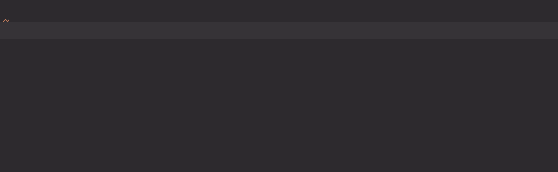

# createDOM_ElementFromHTML_Code

[](https://plugins.jetbrains.com/plugin/17638-yamato-daiwa-es-extensions)


```
createDOM_ElementFromHTML_Code(HTML_Code: string): Element;

createDOM_ElementFromHTML_Code<DOM_ElementSubtype extends Element>(
  namedParameters: {
    HTML_Code: string;
    rootDOM_ElementSubtype: new () => DOM_ElementSubtype;
  }
): DOM_ElementSubtype;
```

Creates the DOM element ([Element](https://developer.mozilla.org/en-US/docs/Web/API/Element)) or it's inheritor from 
HTML code, herewith it must be exactly one root element. If you have more than one root element or not sure that it will
only one single root element, use [createHTML_CollectionFromHTML_Code](createHTML_CollectionFromHTML_Code.md)
function instead.




## Usage

First usage variant requires the HTML code as first and only parameter, herewith instance of 
[Element](https://developer.mozilla.org/en/docs/Web/API/Element) will be returned. 

```typescript
const newDivElement: Element = createDOM_ElementFromHTML_Code("<div></div>");
```

If you want some inheritor of **Element** will be returned (for example, **HTMLDivElement** or **HTMLUListElement**),
pass the reference to desired class inheriting from **Element** via compound parameter with HTML code:

```typescript
const newDivElement: HTMLDivElement = createDOM_ElementFromHTML_Code({
  HTML_Code: "<div></div>",
  rootDOM_ElementSubtype: HTMLDivElement
})
```


## Errors

### InvalidParameterValueError

Will be thrown if passed HTML code does not include the element.

```typescript
const unorderedList: HTMLUListElement = createDOM_ElementFromHTML_Code({
  HTML_Code: "",
  rootDOM_ElementSubtype: HTMLUListElement
});
```

### ImproperUsageError

Will be thrown if passed HTML code includes more than one root element:

```typescript
const unorderedList: HTMLUListElement = createDOM_ElementFromHTML_Code({
  HTML_Code: "<ul><li></li></ul><p></p>",
  rootDOM_ElementSubtype: HTMLUListElement
});
```

### UnexpectedEventError

Will be thrown if **rootDOM_ElementSubtype** does not match with actual root element:  

```typescript
createDOM_ElementFromHTML_Code({
  HTML_Code: "<div></div>",
  rootDOM_ElementSubtype: HTMLInputElement
});
```


## Comparison with native methods

The native implementation of creating of elements will take at least three lines:

```typescript
const delegatingContainer: Document = document.implementation.createHTMLDocument();

delegatingContainer.body.innerHTML = HTML_Code;

return delegatingContainer.body.children;
```

This is the implementation of [createHTML_CollectionFromHTML_Code](createHTML_CollectionFromHTML_Code.md) function.
It returns the [HTMLCollection](https://developer.mozilla.org/en-US/docs/Web/API/HTMLCollection).
Sometimes we need the collection, but sometimes - specific element like **HTMLDivElement** or **HTMLUListElement**.
To extract it, we need to analyze the collection what **createDOM_ElementFromHTML_Code** takes care about.


## Comparison with jQuery 

The method **parseHTML** of [jQuery](https://jquery.com) returns the array of **JQuery.Node[]** which could be 
empty or has more than one element. Because jQuery wraps native elements to **JQuery.Node**, it allows to call
all available methods regardless to element's subtype.
