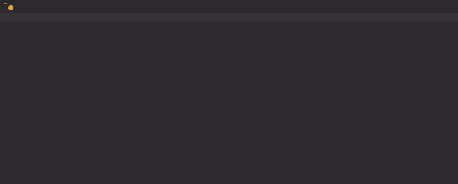

# delegateLeftClickEventHandling

[](https://plugins.jetbrains.com/plugin/17638-yamato-daiwa-es-extensions)

```
(
  compoundParameter: Readonly<{
    eventTargetSelector: string;
    delegatingContainerOrItsSelector: Element | Document | string;
    handler: (clickedElement: Element, event: MouseEvent) => unknown;
  }>
): void

<ClickTargetElement extends Element>(
  compoundParameter: Readonly<{
    eventTargetSelector: string;
    delegatingContainerOrItsSelector: Element | Document | string;
    eventTargetElementSubtype: new () => ClickTargetElement;
    handler: (clickedElement: ClickTargetElement, event: MouseEvent) => unknown;
  }>
): void
```

Provides the delegating of click event functionality, the optimization measure 
(see more about [event delegation pattern](https://javascript.info/event-delegation)). 




## Usage

Below code adds the single click event listener to ".List" element herewith the **handler** will fire when any element
with ".Button" class inside ".List" will be clicked:

```typescript
delegateClickEventHandling({
  eventTargetSelector: ".Button",
  delegatingContainerOrItsSelector: ".List",
  handler: (clickedElement: Element, event: MouseEvent): void => {
    console.log("clicked")
  } 
})
```

The first parameter in the instance of [Element](https://developer.mozilla.org/en-US/docs/Web/API/Element) class. 
If you need the specific inheritor of **Element** class (for example, **HTMLButtonElement**), 
specify it via **eventTargetElementSubtype** parameter:

```typescript
delegateClickEventHandling<HTMLButtonElement>({
  eventTargetSelector: ".Button",
  delegatingContainerOrItsSelector: ".List",
  eventTargetElementSubtype: HTMLButtonElement,
  handler: (clickedElement: HTMLButtonElement, event: MouseEvent): void => {
    clickedElement.blur(); // Now you can use the methods of HTMLButtonElement instance
  }
});
```


## Errors

This function does not throw any errors, just make the log and prevents the handler execution if something going wrong.


### DOM_ElementRetrievingFailedError

Will be logged if there are no element corresponding to selector specified in **delegatingContainerOrItsSelector**
property of compound parameter.


### UnexpectedEventError

Will be logged if:

* Target event is no the mouse event. Currently, it is unclear for us how this error could occur, but for the valid
  TypeScript we must check is `event` in ` delegatingContainer.addEventListener("click", (event: Event): void => {})`
  the instance of `MouseEvent` and if no - terminate the function execution.
* `event.target` is not the instance of [HTMLElement](https://developer.mozilla.org/en-US/docs/Web/API/HTMLElement).
   Actually, except `EventTarget` it could be [Document](https://developer.mozilla.org/en-US/docs/Web/API/Document),
   [Window](https://developer.mozilla.org/en-US/docs/Web/API/Window) and ever something element, but currently it is
   unclear for us which other targets could be in this click event delegating case.
* Event target is not instance of specified `eventTargetElementSubtype`.


## Comparison with native implementation

There is no short native solution.
Here is the solution from [youmightnotneedjquery.com](https://youmightnotneedjquery.com/#delegate):

```javascript
document.addEventListener(eventName, function(e) {
  // loop parent nodes from the target to the delegation node
  for (var target = e.target; target && target != this; target = target.parentNode) {
    if (target.matches(elementSelector)) {
      handler.call(target, e);
        break;
    }
  }
}, false);
```

The **yamato-daiwa/es-extensions** implementation is deeply improved above one.
