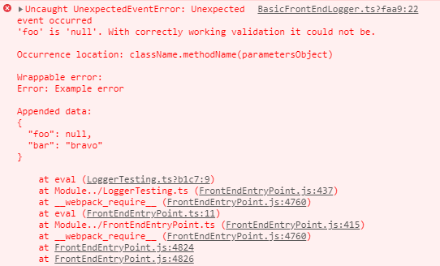
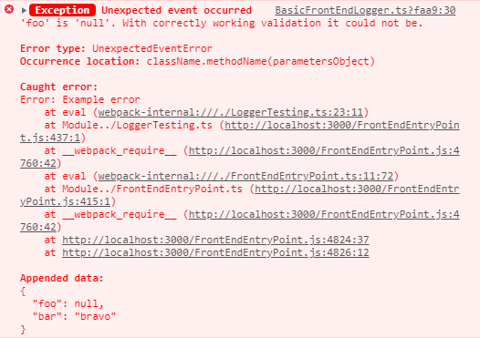
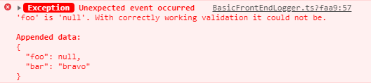
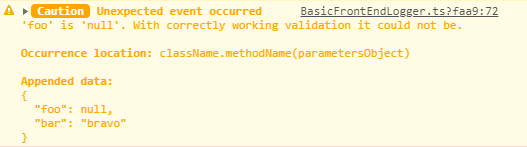
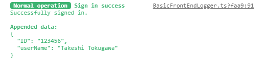
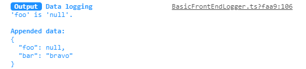

# `BasicFrontEndLogger`

The implementation of `ILogger` interface for the `Logger` facade and browser applications.
As default, it just makes the logs more fancy than default `Logger` formatting what could be enough for early development
phase of the the website / web application development.

```typescript
/* 〔 ✏ 〕 Set `BasicFrontEndLogger` as custom implementation for the `Logger` facade */
Logger.setImplementation(BasicFrontEndLogger);
```

Later you may want to add:

* Limitation of output to console in production mode.
* Submit the logs to some logging service.

[📖 The example for Sentry](https://github.com/TokugawaTakeshi/yamato_daiwa-es_extensions/blob/master/Documentation/BrowserJS/Logging/BasicFrontEndLogger/BasicFrontEndLogger.md#using-of-basicfrontendlogger-for-the-custom-frontendlogger-implementation-on-sentry-example).


## Methods

### `throwErrorAndLog`: throw the error and make log

```
throwErrorAndLog<CustomError extends Error>(errorLog: ThrownErrorLog<CustomError>): never
```

Because this method does not use the `console`, it has not some additional formatting and displays the error as regular
`Logger`.

```typescript
try {
  throw new Error("Example error");
} catch (error: unknown) {
  Logger.throwErrorAndLog({
    errorInstance: new UnexpectedEventError("'foo' is 'null'. With correctly working validation it could not be."),
    title: UnexpectedEventError.DEFAULT_TITLE,
    occurrenceLocation: "className.methodName(parametersObject)",
    wrappableError: error,
    customBadgeText: "Exception",
    additionalData: {
      foo: null,
      bar: "bravo"
    }
  });
}
```




### `logError`: error logging without throwing

```
logError(errorLog: ErrorLog): void
```

```typescript
try {
  throw new Error("Example error");
} catch (error: unknown) {

  Logger.logError({
    errorType: UnexpectedEventError.NAME,
    title: UnexpectedEventError.DEFAULT_TITLE,
    description: "'foo' is 'null'. With correctly working validation it could not be.",
    occurrenceLocation: "className.methodName(parametersObject)",

    customBadgeText: "Exception",
    caughtError: error,
    additionalData: {
      foo: null,
      bar: "bravo"
    }
  });
}
```




### `logErrorLikeMessage`: logging of the message with error highlight and to errors stream

```
logErrorLikeMessage(errorLikeLog: Log): void
```

Logs the simple `Log` with red highlight. In the case of NodeJS, this log will be output to errors stream.

```typescript
Logger.logErrorLikeMessage({
  title: UnexpectedEventError.DEFAULT_TITLE,
  description: "'foo' is 'null'. With correctly working validation it could not be.",
  customBadgeText: "Exception",
  additionalData: {
    foo: null,
    bar: "bravo"
  }
});
```




### `logWarning`: logging of the warnings

```
logWarning(warningLog: WarningLog): void
```

```typescript
Logger.logWarning({
  customBadgeText: "Caution",
  title: UnexpectedEventError.DEFAULT_TITLE,
  occurrenceLocation: "className.methodName(parametersObject)",
  description: "'foo' is 'null'. With correctly working validation it could not be.",
  additionalData: {
    foo: null,
    bar: "bravo"
  }
});
```




### `logSuccess`: logging of the success messages

```
logSuccess(successLog: SuccessLog): void
```

```typescript
Logger.logSuccess({
  title: "Sign in success",
  description: "Successfully signed in.",
  customBadgeText: "Normal operation",
  additionalData: {
    ID: "123456",
    userName: "Takeshi Tokugawa"
  }
});
```




### `logInfo`: logging of the other messages

```
logInfo(infoLog: InfoLog): void 
```

```typescript
Logger.logInfo({
  customBadgeText: "Output",
  title: "Data logging",
  description: "'foo' is 'null'.",
  additionalData: {
    foo: null,
    bar: "bravo"
  }
});
```




### `generateConsoleMethodParametersForFormattedOutput`: generating of the formatted console output

```
generateConsoleMethodParametersForFormattedOutput(
  formattedOutputData: BasicFrontEndLogger.FormattedOutputData
): Array<string>
``` 

```typescript
type FormattedOutputData = Array<[string, { [CSS_Key: string]: string; }]>;
```

To format the console output natively, it's required mark all stylable substrings by `%c` than define the styles of each
stylable substirngs in subsequent parameters:

```typescript
console.log(
  "%cALPHA " +  // 1st substring
  "%cBRAVO " +   // 2nd substring
  "%cCHARLIE " + // 3rd substring
  "%cDELTA ", // 4th substring
  "color: #e74c3c; font-weight: bold;", // Styles for the 1st substring
  "color: #27ae60; font-style: italic", // Styles for the 2nd substring
  "color: #2980b9; text-decoration: underline", // Styles for the 3rd substring
  "color: #f39c12;"  // Styles for the 4th substring
);
```


The method `generateConsoleMethodParametersForFormattedOutput` suggests more readable syntax.


```typescript
BasicFrontEndLogger.generateConsoleMethodParametersForFormattedOutput([
  [ "ALPHA", { color: "#e74c3c", "font-weight": "bold" } ],
  [ "BRAVO", { color: "#27ae60", "font-style": "italic" } ],
  [ "CHARLIE", { color: "#2980b9", "text-decoration": "underline" } ],
  [ "DELTA", { color: "#f39c12" } ],
])
```

Using this method, you can redefine the default formatting of `logInfo`, `logSuccess` etc.


## Using of `BasicFrontEndLogger` for the custom `FrontendLogger` implementation on `Sentry` example

The common concept is:

* On production building mode (`__IS_PRODUCTION_BUILDING_MODE__` global variable) we are submitting the log by Sentry API.
  In the case of `throwErrorAndLog`, we should erase the error's message to hide it from users but still need to trow it.
* On other project building modes basically no need to submit the data, so you can delegate the console output to
  `BasicFrontEndLogger`.
  
You can implement the `FrontEndLogger` as:
* Class with static methods only as in example below. In this case it must me compatible with `ILogger` interface.
* Class with non-static methods. It's recommended to specify `implements ILogger` but anyway compatibly will be checked
  by TypeScript when calling `Logger.setImplementation`.
* Plain ECMAScript object.

Below example implemented by the first approach to avoid warning messages like "Expected the usage of 'this' in 
non-static method".

You also need to initialize the Sentry. It's possible to add the initialization to class or initialize Sentry separately,
for example, in the entry point of your application.

```typescript
import {
  Logger,
  ThrownErrorLog,
  ErrorLog,
  Log,
  WarningLog,
  SuccessLog,
  InfoLog,
  stringifyAndFormatUnknownAtAdvanceEntity
} from "hikari-es-extensions";
import { BasicFrontEndLogger } from "hikari-es-extensions/BrowserJS";
import * as Sentry from "@sentry/browser";


abstract class FrontEndLogger {

  public static throwErrorAndLog<CustomError extends Error>(errorLog: ThrownErrorLog<CustomError>): never {

    if (!__IS_PRODUCTION_BUILDING_MODE__) {
      BasicFrontEndLogger.throwErrorAndLog(errorLog);
    }

    Sentry.captureException(errorLog);

    if ("errorInstance" in errorLog) {

      /* 〔 ✏ 〕 Hide the error message from the users. */
      errorLog.errorInstance.message = "";
      /* 〔 ✏ 〕 Do not erase "errorInstance.name" by same way because it could brake the errors interception. */

      /* 〔 ESLint muting rationale 〕 In this case the 'errorInstance' is the instance of 'Error' or it's inheritor.
      *    Although '@typescript-eslint' considers the throwing of is as a violation, this scenario has not been mentioned
      *    in incorrect code example of 'no-throw-literal' rule documentation.
      *    https://github.com/typescript-eslint/typescript-eslint/blob/master/packages/eslint-plugin/docs/rules/no-throw-literal.md */
      /* eslint-disable-next-line @typescript-eslint/no-throw-literal */
      throw errorLog.errorInstance;
    }


    const errorWillBeThrown: Error = new Error();
    errorWillBeThrown.name = errorLog.errorType;

    throw errorWillBeThrown;
  }

  public static logError(errorLog: ErrorLog): void {

    if (!__IS_PRODUCTION_BUILDING_MODE__) {
      BasicFrontEndLogger.logError(errorLog);
      return;
    }

    /* 〔 ✏ 〕 Plain "JSON.stringify()" could cause the other error if the "errorLog.caughtError" or "errorLog.additionalData"
    *     are circular. */
    Sentry.captureMessage(stringifyAndFormatUnknownAtAdvanceEntity(errorLog), Sentry.Severity.Error);
  }

  public static logErrorLikeMessage(errorLikeLog: Log): void {

    if (!__IS_PRODUCTION_BUILDING_MODE__) {
      BasicFrontEndLogger.logErrorLikeMessage(errorLikeLog);
      return;
    }

    Sentry.captureMessage(stringifyAndFormatUnknownAtAdvanceEntity(errorLikeLog), Sentry.Severity.Error);
  }

  public static logWarning(warningLog: WarningLog): void {

    if (!__IS_PRODUCTION_BUILDING_MODE__) {
      BasicFrontEndLogger.logWarning(warningLog);
    }

    Sentry.captureMessage(stringifyAndFormatUnknownAtAdvanceEntity(warningLog), Sentry.Severity.Warning);
  }

  public static logSuccess(successLog: SuccessLog): void {

    if (!__IS_PRODUCTION_BUILDING_MODE__) {
      BasicFrontEndLogger.logSuccess(successLog);
    }

    Sentry.captureMessage(stringifyAndFormatUnknownAtAdvanceEntity(successLog), Sentry.Severity.Log);
  }

  public static logInfo(infoLog: InfoLog): void {

    if (!__IS_PRODUCTION_BUILDING_MODE__) {
      BasicFrontEndLogger.logSuccess(infoLog);
    }

    Sentry.captureMessage(stringifyAndFormatUnknownAtAdvanceEntity(infoLog), Sentry.Severity.Info);
  }

  public static highlightText(targetString: string): string {
    return BasicFrontEndLogger.highlightText(targetString);
  }
}
```
