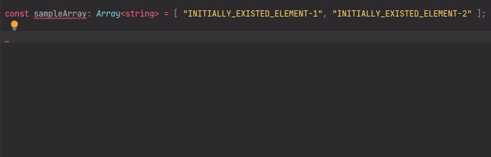

# `addElementsToArray`: Add elements to array

[](https://plugins.jetbrains.com/plugin/17638-yamato-daiwa-es-extensions)

```
(
  namedParameters:
      (
        {
          mutably: true;
          targetArray: Array<ArrayElement>;
        } |
        {
          mutably: false;
          targetArray: ReadonlyArray<ArrayElement>;
        }
      ) &
      { newElements: ReadonlyArray<ArrayElement>; } &
      (
        { toStart: true; } |
        { toEnd: true; } |
        { toPosition__numerationFrom0: number; } |
        { toPosition__numerationFrom1: number; }
      )
): Array<ArrayElement> {
```

Adds one or more elements to the start, end or specified position of target array, herewith the adding could be mutable 
or not depending on dedicated property of named parameters object.




## Examples
### Add one element to start
#### Mutably

```typescript
const sampleArray: Array<string> = [ "INITIALLY_EXISTED_ELEMENT-1", "INITIALLY_EXISTED_ELEMENT-2" ];

addElementsToArray({
  targetArray: sampleArray,
  newElements: [ "NEW_ELEMENT-1" ],
  toStart: true,
  mutably: true
});

console.log(sampleArray); // => [ "NEW_ELEMENT-1", "INITIALLY_EXISTED_ELEMENT-1", "INITIALLY_EXISTED_ELEMENT-2" ]
```

#### Immutably

```typescript
const sampleArray: Array<string> = [ "INITIALLY_EXISTED_ELEMENT-1", "INITIALLY_EXISTED_ELEMENT-2" ];

const updatedCopyOfSampleArray: Array<string> = addElementsToArray({
  targetArray: sampleArray,
  newElements: [ "NEW_ELEMENT-1" ],
  toStart: true,
  mutably: false
});

console.log(updatedCopyOfSampleArray); // => [ "NEW_ELEMENT-1", "INITIALLY_EXISTED_ELEMENT-1", "INITIALLY_EXISTED_ELEMENT-2" ]
console.log(sampleArray); // => [ "INITIALLY_EXISTED_ELEMENT-1", "INITIALLY_EXISTED_ELEMENT-2" ]
```

### Add multiple elements to start
#### Mutably

```typescript
const sampleArray: Array<string> = [ "INITIALLY_EXISTED_ELEMENT-1", "INITIALLY_EXISTED_ELEMENT-2" ];

addElementsToArray({
  targetArray: sampleArray,
  newElements: [ "NEW_ELEMENT-1", "NEW_ELEMENT-2" ],
  toStart: true,
  mutably: true
});

console.log(sampleArray); // => [ "NEW_ELEMENT-1", "NEW_ELEMENT-2", "INITIALLY_EXISTED_ELEMENT-1", "INITIALLY_EXISTED_ELEMENT-2" ]
```

#### Immutably

```typescript
const sampleArray: Array<string> = [ "INITIALLY_EXISTED_ELEMENT-1", "INITIALLY_EXISTED_ELEMENT-2" ];

const updatedCopyOfSampleArray: Array<string> = addElementsToArray({
  targetArray: sampleArray,
  newElements: [ "NEW_ELEMENT-1", "NEW_ELEMENT-2" ],
  toStart: true,
  mutably: false
});

console.log(updatedCopyOfSampleArray); // => [ "NEW_ELEMENT-1", "NEW_ELEMENT-2", "INITIALLY_EXISTED_ELEMENT-1", "INITIALLY_EXISTED_ELEMENT-2" ]
console.log(sampleArray); // => [ "INITIALLY_EXISTED_ELEMENT-1", "INITIALLY_EXISTED_ELEMENT-2" ]
```


### Add one element to end
#### Mutably

```typescript
const sampleArray: Array<string> = [ "INITIALLY_EXISTED_ELEMENT-1", "INITIALLY_EXISTED_ELEMENT-2" ];

addElementsToArray({
  targetArray: experimentalSample,
  newElements: [ "NEW_ELEMENT-1" ],
  toEnd: true,
  mutably: true
});

console.log(sampleArray); // => [ "INITIALLY_EXISTED_ELEMENT-1", "INITIALLY_EXISTED_ELEMENT-2", "NEW_ELEMENT-1" ]
```

#### Immutably

```typescript
const sampleArray: Array<string> = [ "INITIALLY_EXISTED_ELEMENT-1", "INITIALLY_EXISTED_ELEMENT-2" ];

const updatedCopyOfSampleArray: Array<string> = addElementsToArray({
  targetArray: sampleArray,
  newElements: [ "NEW_ELEMENT-1" ],
  toEnd: true,
  mutably: false
});

console.log(updatedCopyOfSampleArray); // => [ "INITIALLY_EXISTED_ELEMENT-1", "INITIALLY_EXISTED_ELEMENT-2", "NEW_ELEMENT-1" ]
console.log(sampleArray); // => [ "INITIALLY_EXISTED_ELEMENT-1", "INITIALLY_EXISTED_ELEMENT-2" ]
```

### Add multiple elements to end

#### Mutably

```typescript
const sampleArray: Array<string> = [ "INITIALLY_EXISTED_ELEMENT-1", "INITIALLY_EXISTED_ELEMENT-2" ];

addElementsToArray({
  targetArray: experimentalSample,
  newElements: [ "NEW_ELEMENT-1", "NEW_ELEMENT-2" ],
  toEnd: true,
  mutably: true
});

console.log(sampleArray); // => [ "INITIALLY_EXISTED_ELEMENT-1", "INITIALLY_EXISTED_ELEMENT-2", "NEW_ELEMENT-1", "NEW_ELEMENT-2" ]
```

#### Immutably

```typescript
const sampleArray: Array<string> = [ "INITIALLY_EXISTED_ELEMENT-1", "INITIALLY_EXISTED_ELEMENT-2" ];

const updatedCopyOfSampleArray: Array<string> = addElementsToArray({
  targetArray: sampleArray,
  newElements: [ "NEW_ELEMENT-1", "NEW_ELEMENT-2" ],
  toEnd: true,
  mutably: false
});

console.log(updatedCopyOfSampleArray); // => [ "INITIALLY_EXISTED_ELEMENT-1", "INITIALLY_EXISTED_ELEMENT-2", "NEW_ELEMENT-1", "NEW_ELEMENT-2" ]
console.log(sampleArray); // => [ "INITIALLY_EXISTED_ELEMENT-1", "INITIALLY_EXISTED_ELEMENT-2" ]
```


### Add one element to specific position
#### Mutably

```typescript
const sampleArray: Array<string> = [ "INITIALLY_EXISTED_ELEMENT-1", "INITIALLY_EXISTED_ELEMENT-2" ];

addElementsToArray({
  targetArray: sampleArray,
  newElements: [ "NEW_ELEMENT-1" ],
  toPosition__numerationFrom0: 1,
  mutably: true
});

console.log(sampleArray);  // => [ "INITIALLY_EXISTED_ELEMENT-1", "NEW_ELEMENT-1", "INITIALLY_EXISTED_ELEMENT-2" ]
```

Or if to specify the position from 1, the equivalent will be:

```typescript
const sampleArray: Array<string> = [ "INITIALLY_EXISTED_ELEMENT-1", "INITIALLY_EXISTED_ELEMENT-2" ];

addElementsToArray({
  targetArray: sampleArray,
  newElements: [ "NEW_ELEMENT-1" ],
  toPosition__numerationFrom1: 2,
  mutably: true
});

console.log(sampleArray);  // => [ "INITIALLY_EXISTED_ELEMENT-1", "NEW_ELEMENT-1", "INITIALLY_EXISTED_ELEMENT-2" ]
```

### Immutably

```typescript
const sampleArray: Array<string> = [ "INITIALLY_EXISTED_ELEMENT-1", "INITIALLY_EXISTED_ELEMENT-2" ];

const updatedCopyOfSampleArray: Array<string> = addElementsToArray({
  targetArray: experimentalSample,
  newElements: [ "NEW_ELEMENT-1" ],
  toPosition__numerationFrom0: 1,
  mutably: false
});

console.log(updatedCopyOfSampleArray); // => [ "INITIALLY_EXISTED_ELEMENT-1", "NEW_ELEMENT-1", "INITIALLY_EXISTED_ELEMENT-2" ]
console.log(sampleArray); // => [ "INITIALLY_EXISTED_ELEMENT-1", "INITIALLY_EXISTED_ELEMENT-2" ]
```

Or if to specify the position from 1, the equivalent will be:

```typescript
const sampleArray: Array<string> = [ "INITIALLY_EXISTED_ELEMENT-1", "INITIALLY_EXISTED_ELEMENT-2" ];

const updatedCopyOfSampleArray: Array<string> = addElementsToArray({
  targetArray: experimentalSample,
  newElements: [ "NEW_ELEMENT-1" ],
  toPosition__numerationFrom1: 2,
  mutably: false
});

console.log(updatedCopyOfSampleArray); // => [ "INITIALLY_EXISTED_ELEMENT-1", "NEW_ELEMENT-1", "INITIALLY_EXISTED_ELEMENT-2" ]
console.log(sampleArray); // => [ "INITIALLY_EXISTED_ELEMENT-1", "INITIALLY_EXISTED_ELEMENT-2" ]
```


### Add multiple elements to specific position

```typescript
const sampleArray: Array<string> = [ "INITIALLY_EXISTED_ELEMENT-1", "INITIALLY_EXISTED_ELEMENT-2" ];

addElementsToArray({
  targetArray: sampleArray,
  newElements: [ "NEW_ELEMENT-1", "NEW_ELEMENT-2" ],
  toPosition__numerationFrom0: 1,
  mutably: true
});

console.log(sampleArray);  // => [ "INITIALLY_EXISTED_ELEMENT-1", "NEW_ELEMENT-1", "NEW_ELEMENT-2", "INITIALLY_EXISTED_ELEMENT-2" ]
```

Or if to specify the position from 1, the equivalent will be:

```typescript
const sampleArray: Array<string> = [ "INITIALLY_EXISTED_ELEMENT-1", "INITIALLY_EXISTED_ELEMENT-2" ];

addElementsToArray({
  targetArray: sampleArray,
  newElements: [ "NEW_ELEMENT-1", "NEW_ELEMENT-2" ],
  toPosition__numerationFrom1: 2,
  mutably: true
});

console.log(sampleArray);  // => [ "INITIALLY_EXISTED_ELEMENT-1", "NEW_ELEMENT-1", "INITIALLY_EXISTED_ELEMENT-2" ]
```

### Immutably

```typescript
const sampleArray: Array<string> = [ "INITIALLY_EXISTED_ELEMENT-1", "INITIALLY_EXISTED_ELEMENT-2" ];

const updatedCopyOfSampleArray: Array<string> = addElementsToArray({
  targetArray: experimentalSample,
  newElements: [ "NEW_ELEMENT-1", "NEW_ELEMENT-2" ],
  toPosition__numerationFrom0: 1,
  mutably: false
});

console.log(updatedCopyOfSampleArray); // => [ "INITIALLY_EXISTED_ELEMENT-1", "NEW_ELEMENT-1", "NEW_ELEMENT-2", "INITIALLY_EXISTED_ELEMENT-2" ]
console.log(sampleArray); // => [ "INITIALLY_EXISTED_ELEMENT-1", "INITIALLY_EXISTED_ELEMENT-2" ]
```

Or if to specify the position from 1, the equivalent will be:

```typescript
const sampleArray: Array<string> = [ "INITIALLY_EXISTED_ELEMENT-1", "INITIALLY_EXISTED_ELEMENT-2" ];

const updatedCopyOfSampleArray: Array<string> = addElementsToArray({
  targetArray: experimentalSample,
  newElements: [ "NEW_ELEMENT-1", "NEW_ELEMENT-2" ],
  toPosition__numerationFrom1: 2,
  mutably: false
});

console.log(updatedCopyOfSampleArray); // => [ "INITIALLY_EXISTED_ELEMENT-1", "NEW_ELEMENT-1", "NEW_ELEMENT-2", "INITIALLY_EXISTED_ELEMENT-2" ]
console.log(sampleArray); // => [ "INITIALLY_EXISTED_ELEMENT-1", "INITIALLY_EXISTED_ELEMENT-2" ]
```


## Quick inputting

Use [Live templates](https://www.jetbrains.com/help/idea/using-live-templates.html#live_templates_types) functionality
of [IntelliJ IDEA family IDEs](https://www.jetbrains.com/idea/) (including WebStorm sharpened for web development) for
quick input:


Copy the variable name containing array to clipboard preliminary - the identifier will be automatically substituted to 
  required position. 
Then, use <kbd>Tab</kbd> key to move to next position at which specific code must be inputted.
