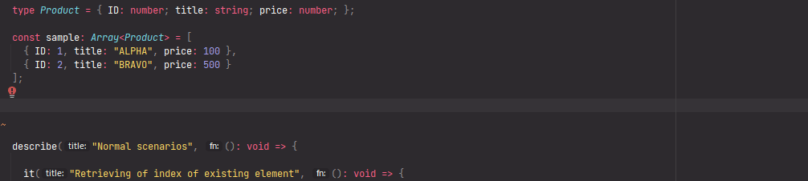

# `getIndexOfArrayElementSatisfiesThePredicateIfSuchElementIsExactlyOne` - Get index of array element is such element is exactly one

[](https://plugins.jetbrains.com/plugin/17638-yamato-daiwa-es-extensions)

```
<ArrayElement>(
  targetArray: ReadonlyArray<ArrayElement>, 
  predicate: (arrayElement: ArrayElement) => boolean
): number | null;

<ArrayElement>(
  targetArray: ReadonlyArray<ArrayElement>,
  predicate: (arrayElement: ArrayElement) => boolean,
  options: Readonly<{ throwErrorIfElementNotFoundOrMoreThan1: true; }>
): number;
```

* Returns the index of array element matching with the `predicate` is such element is exactly one in `targetArray`.
* If the element matching with the `predicate` is not presents or there are multiple matches with the predicate,
  * **UnexpectedEventError** error will be thrown if `mustThrowErrorIfElementNotFoundOrMatchesAreMultiple` option has been specified as `true`.
  * otherwise `null` will be returned

If multiple elements matching with the predicate are being expected in **targetArray** and you want indexes of all of them,
use [**getIndexesOfSatisfiesThePredicateArrayElements**](https://github.com/TokugawaTakeshi/Yamato-Daiwa-ES-Extensions/blob/master/CoreLibrary/Package/Documentation/Arrays/getIndexesOfSatisfiesThePredicateArrayElements/getIndexesOfSatisfiesThePredicateArrayElements.md)
function instead.




## Comparing with native methods
### Array.prototype.findIndex

Returns index of first element matching with predicate is such element exists, otherwise returns `-1`.
This native method neither better nor worse than **getIndexOfArrayElementSatisfiesThePredicateIfSuchElementIsExactlyOne**;
which one to use is depending on which behavior you need if

* will not be desired element in array
* will be more than one matching with predicate.

Even if both scenarios expected to be impossible, it could occur during debugging.


## Examples

Below examples will use this sample array of objects:

```typescript
type Product = { ID: number; title: string; price: number; };

const sample: Array<Product> = [
  { ID: 1, title: "ALPHA", price: 100 },
  { ID: 2, title: "BRAVO", price: 500 }
];
```

### One match (normal scenario)

```typescript
console.log(
  getIndexOfArrayElementSatisfiesThePredicateIfSuchElementIsExactlyOne(
    sample, (product: Product): boolean => product.ID === 2
  )
); // -> 1
```

### More than one match
#### Returning of null

```typescript
console.log(
  getIndexOfArrayElementSatisfiesThePredicateIfSuchElementIsExactlyOne(
    sample, (product: Product): boolean => product.price > 50
  )
); // -> null
```

#### Throwing of the error

```typescript
let indexOfDesiredElement: number;

try {

  indexOfDesiredElement = getIndexOfArrayElementSatisfiesThePredicateIfSuchElementIsExactlyOne(
    sample,
    (product: Product): boolean => product.price > 50,
    { mustThrowErrorIfElementNotFoundOrMatchesAreMultiple: true }
  );
  
} catch (error) {
  if (error instanceof UnexpectedEventError) {
    console.error("What!? I expected exactly one!");
  }
}
```

### No matches
#### Returning of `null`

```typescript
console.log(
  getIndexOfArrayElementSatisfiesThePredicateIfSuchElementIsExactlyOne(
    sample, (product: Product): boolean => product.ID === 3
  )
); // -> null
```

#### Throwing of the error

```typescript
let indexOfDesiredElement: number;

try {

  indexOfDesiredElement = getIndexOfArrayElementSatisfiesThePredicateIfSuchElementIsExactlyOne(
    sample,
    (product: Product): boolean => product.ID === 3,
    { mustThrowErrorIfElementNotFoundOrMatchesAreMultiple: true }
  );
  
} catch (error) {
  if (error instanceof UnexpectedEventError) {
    console.error("What!? I expected exactly one!");
  }
}
```


## Quick inputting

Use [Live templates](https://www.jetbrains.com/help/idea/using-live-templates.html#live_templates_types) functionality
of [IntelliJ IDEA family IDEs](https://www.jetbrains.com/idea/) (including WebStorm sharpened for web development) for
quick input:


It is recommended to copy the variable name containing array to clipboard preliminary - the identifier will be
automatically substituted to required position. Then, use <kbd>Tab</kbd> key to move to next position at which
specific code must be inputted.

Because the abbreviation of `getIndexOfArrayElementSatisfiesThePredicateIfSuchElementIsExactlyOne` is too long (gioaestpiseieo),
the live template has been added without abbreviation (however, you don't need to input whole function name).
Please make sure that you are selecting the live template, not just function name from the suggested autocompletes.
