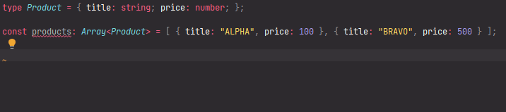

# `getIndexesOfArrayElementsWhichSatisfiesThePredicate`: Retrieving of indexes of array elements which satisfied to predicate

[](https://plugins.jetbrains.com/plugin/17638-yamato-daiwa-es-extensions)

```
getIndexesOfArrayElementsWhichSatisfiesThePredicate<ArrayElement>(
  targetArray: Array<ArrayElement>, predicate: (arrayElement: ArrayElement) => boolean
): Array<number>
```

Returns the array of indexes of `targetArray`'s elements which are satisfies the `predicate` function.



```typescript
type Product = { title: string; price: number; };

const sample1: Array<Product> = [
  { title: "ALPHA", price: 100 },
  { title: "BRAVO", price: 500 },
  { title: "CHARLIE", price: 1000 },
  { title: "DELTA", price: 1500 }
];

getIndexesOfArrayElementsWhichSatisfiesThePredicate(
  sample1, (arrayElement: Product): boolean => arrayElement.price > 500
); // => Expected output: [ 2, 3 ]

getIndexesOfArrayElementsWhichSatisfiesThePredicate(
  sample1, (arrayElement: Product): boolean => arrayElement.price > 1500
); // => Expected output: []
```

## Quick Inputting

Use [Live templates](https://www.jetbrains.com/help/idea/using-live-templates.html#live_templates_types) functionality
of [IntelliJ IDEA family IDEs](https://www.jetbrains.com/idea/) (including WebStorm sharpened for web development)
to insert the example (available in [official YDEE plugin](https://plugins.jetbrains.com/plugin/17638-yamato-daiwa-es-extensions)):


It is recommended to copy the variable name containing array to clipboard preliminary - the identifier will be
automatically substituted to required position.

Because the abbreviation of `getIndexesOfArrayElementsWhichSatisfiesThePredicate` is too long (gioaewstp),
the live template has been added without abbreviation (however, you don't need to input whole function name).
Please make sure that you are selecting the live template, not just function name from the suggested autocompletes.
