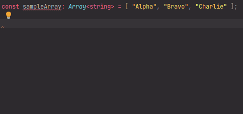

# `removeArrayElementsByIndexes` - Remove array elements by indexes

[](https://plugins.jetbrains.com/plugin/17638-yamato-daiwa-es-extensions)

```
removeArrayElementsByIndexes<ArrayElement>(
  compoundParameter: CompoundParameter<ArrayElement>
): Result<ArrayElement>
```

```typescript
export type CompoundParameter<ArrayElement> = {
  targetArray: Array<ArrayElement>;
  indexes: number | Array<number>;
  mutably: boolean;
};

export type Result<ArrayElement> = {
  updatedArray: Array<ArrayElement>;
  removedElements: Array<ArrayElement>;
};
```

Removes array elements by indexes, herewith the removing could be mutable or not depending on dedicated property of 
compound parameter.



## Usage
### Mutable removing

```typescript
const sample: Array<string> = [ "alpha", "bravo", "charlie", "delta" ];

console.log(
  removeArrayElementsByIndexes({
    targetArray: sample,
    indexes: [ 1, 3 ],
    mutably: true
  }).removedElements
);
```

will output: 

```
[ "bravo", "delta" ]
```

and make initial array mutate to:

```
[ "alpha", "charlie" ]
```


### Non-mutable removing

Non-mutable removing is demanded by JavaScript frameworks which could not observe the mutations of array.

```typescript
const sample: Array<string> = [ "alpha", "bravo", "charlie", "delta" ];

console.log(
  removeArrayElementsByIndexes({
    targetArray: sample,
    indexes: 2,
    mutably: false
  }).updatedArray
); // => 
```

will output:

```
[ "alpha", "charlie" ]
```

but does not affect to initial array.


### Quick inputting

Use [Live templates](https://www.jetbrains.com/help/idea/using-live-templates.html#live_templates_types) functionality
of [IntelliJ IDEA family IDEs](https://www.jetbrains.com/idea/) (including WebStorm sharpened for web development)
to input the function calling expression quickly (available in [official YDEE plugin](https://plugins.jetbrains.com/plugin/17638-yamato-daiwa-es-extensions)):


If target array has been copied to clipboard preliminarily, it will be immediately substituted.
