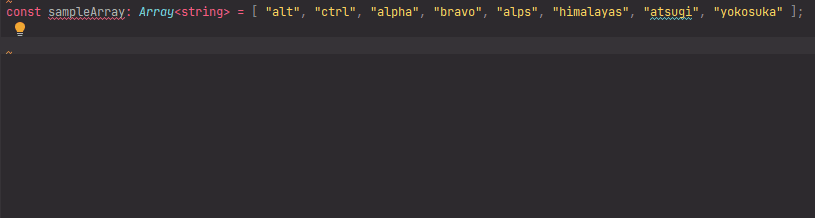

# `removeArrayElementsByPredicates`: Remove array elements by predicates

[](https://plugins.jetbrains.com/plugin/17638-yamato-daiwa-es-extensions)

```
removeArrayElementsByPredicates<ArrayElement>(
  namedParameters: NamedParameters<ArrayElement>
): Result<ArrayElement>
```

```typescript
export type NamedParameters<ArrayElement> =
  {
    readonly targetArray: Array<ArrayElement>;
    readonly mutably: boolean;
  } & (
    { readonly predicate: (arrayElement: ArrayElement) => boolean; } |
    { readonly predicates: Array<(arrayElement: ArrayElement) => boolean>; }
  );

export type Result<ArrayElement> = {
  readonly updatedArray: Array<ArrayElement>;
  readonly removedElements: Array<ArrayElement>;
  readonly indexesOfRemovedElements: Array<number>;
};
```

Removes array elements by one or more predicates, herewith the removing could be mutable or not depending on dedicated 
property of named parameters object. 

Note that in the case of multiple predicates the searching is being executed *sequentially* for each predicate - the 
concept of [logical disjunction](https://en.wikipedia.org/wiki/Logical_disjunction) AKA "or" (bot not "exclusive or").
If you want element will be removed only if it satisfies to all predicates, pass the single predicate including the
logical expression with all conditions.




## Usage
### Mutable removing

```typescript
const sample: Array<string> = [ "a", "aa", "aaa", "aaaa", "aaaaa" ];

console.log(
  removeArrayElementsByPredicates({
    targetArray: sample,
    predicate,
    mutably: true
  }).removedElements
);
```

will output:

```
[ "aaaa", "aaaaa" ]
```

and make initial array mutate to:

```
[ "a", "aa", "aaa" ]
```

Example with two predicates:

```typescript
const sample: Array<string> = [ "alt", "ctrl", "alpha", "bravo", "alps", "himalayas", "atsugi", "yokosuka" ];

console.log(
  removeArrayElementsByPredicates<string>({
    targetArray: sample,
    predicates: [
      (element: string): boolean => element.startsWith("a"),
      (element: string): boolean => element.length < 5
    ],
    mutably: true
  }).removedElements
);
```

will output:

```
[ "alt", "ctrl", "alpha", "alps", "atsugi" ]
```

and make initial array mutate to:

```
[ "bravo", "himalayas", "yokosuka" ]
```


### Non-mutable removing

Non-mutable removing is demanded by JavaScript frameworks which could not observe the mutations of array.

```typescript
const sample: Array<string> = [ "alt", "ctrl", "alpha", "bravo", "alps", "himalayas", "atsugi", "yokosuka" ];

console.log(
  removeArrayElementsByPredicates({
    targetArray: sample,
    predicates: [
      (element: string): boolean => element.startsWith("a"),
      (element: string): boolean => element.length < 5
    ],
    mutably: false
  }).updatedArray
); 
```

will output:

```
[ "bravo", "himalayas", "yokosuka" ]
```

but does not affect to initial array.


## Quick inputting

Use [Live templates](https://www.jetbrains.com/help/idea/using-live-templates.html#live_templates_types) functionality
of [IntelliJ IDEA family IDEs](https://www.jetbrains.com/idea/) (including WebStorm sharpened for web development)
to input the function calling expression quickly (available in [official YDEE plugin](https://plugins.jetbrains.com/plugin/17638-yamato-daiwa-es-extensions)):


If target array has been copied to clipboard preliminarily, it will be immediately substituted.
