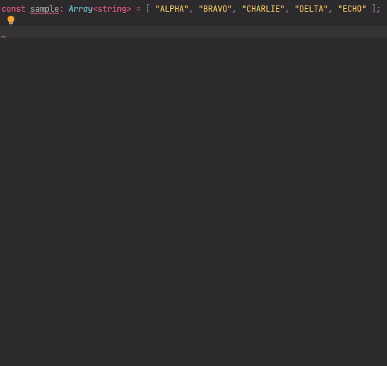

# `replaceArrayElementsByPredicates` - Replace array elements by predicates

[](https://plugins.jetbrains.com/plugin/17638-yamato-daiwa-es-extensions)

```
replaceArrayElementsByPredicates<ArrayElement>(namedParameters: NamedParameters<ArrayElement>): Result<ArrayElement>
```

```typescript
export type NamedParameters<ArrayElement> = 
  {
    readonly targetArray: Array<ArrayElement>;
    readonly mutably: boolean;
  } & 
  (
    { readonly replacement: Replacement<ArrayElement>; } |
    { readonly replacements: Array<Replacement<ArrayElement>>; }
  );

export type Replacement<ArrayElement> =
  {
    readonly predicate: (arrayElement: ArrayElement) => boolean;
  } & 
  (
    { readonly newValue: ArrayElement; } |
    { readonly replacer: (currentValueOfElement: ArrayElement) => ArrayElement; }
  );

export type Result<ArrayElement> = {
  readonly updatedArray: Array<ArrayElement>;
  readonly indexesOfReplacedElements: Array<number>;
};
```

Replaces array elements by one or more predicates, herewith the replacing could be mutable or not depending on dedicated
property of named parameters object.



If target array has been copied to clipboard preliminarily, it will be immediately substituted.


## Example

### Replace one element
#### Mutably

```typescript
const sample: Array<string> = [ "ALPHA", "BRAVO", "CHARLIE", "DELTA", "ECHO" ];

replaceArrayElementsByPredicates({
  targetArray: experimentalSample,
  replacement: {
    predicate: (element: string): boolean => element.includes("O"),
    newValue: "OOO!"
  },
  mutably: true
});

console.log(sample); // => [ "ALPHA", "OOO!", "CHARLIE", "DELTA", "OOO!" ]
```

#### Immutably

```typescript
const sample: Array<string> = [ "ALPHA", "BRAVO", "CHARLIE", "DELTA", "ECHO" ];

const clonedAndUpdatedSample: Array<string> = replaceArrayElementsByPredicates({
  targetArray: experimentalSample,
  replacement: {
    predicate: (element: string): boolean => element.includes("O"),
    newValue: "OOO!"
  },
  mutably: false
})

console.log(clonedAndUpdatedSample); // => [ "ALPHA", "OOO!", "CHARLIE", "DELTA", "OOO!" ]
console.log(sample); // => [ "ALPHA", "BRAVO", "CHARLIE", "DELTA", "ECHO" ]
```


### Replace multiple elements
#### Mutably

```typescript
const sample: Array<string> = [ "ALPHA", "BRAVO", "CHARLIE", "DELTA", "ECHO" ];

replaceArrayElementsByPredicates({
  targetArray: experimentalSample,
  replacements: [
    {
      predicate: (element: string): boolean => element.includes("O"),
      newValue: "OOO!"
    },
    {
      predicate: (element: string): boolean => element.includes("I"),
      replacer: (currentValueOfElement: string): string => `${currentValueOfElement.replace("I", "III")}!!!`
    }
  ],
  mutably: true
});

console.log(sample); // => [ "ALPHA", "OOO!", "CHARLIIIE!!!", "DELTA", "OOO!" ]
```

#### Immutably

```typescript
const sample: Array<string> = [ "ALPHA", "BRAVO", "CHARLIE", "DELTA", "ECHO" ];

const clonedAndUpdatedSample: Array<string> =  replaceArrayElementsByPredicates({
  targetArray: experimentalSample,
  replacements: [
    {
      predicate: (element: string): boolean => element.includes("O"),
      newValue: "OOO!"
    },
    {
      predicate: (element: string): boolean => element.includes("I"),
      replacer: (currentValueOfElement: string): string => `${currentValueOfElement.replace("I", "III")}!!!`
    }
  ],
  mutably: false
});

console.log(clonedAndUpdatedSample); // => [ "ALPHA", "OOO!", "CHARLIIIE!!!", "DELTA", "OOO!" ]
console.log(sample); // => [ "ALPHA", "BRAVO", "CHARLIE", "DELTA", "ECHO" ]
```


## Quick inputting

Use [Live templates](https://www.jetbrains.com/help/idea/using-live-templates.html#live_templates_types) functionality
of [IntelliJ IDEA family IDEs](https://www.jetbrains.com/idea/) (including WebStorm sharpened for web development)
to input the function calling expression quickly (available in [official YDEE plugin](https://plugins.jetbrains.com/plugin/17638-yamato-daiwa-es-extensions)):


If target array has been copied to clipboard preliminarily, it will be immediately substituted.
