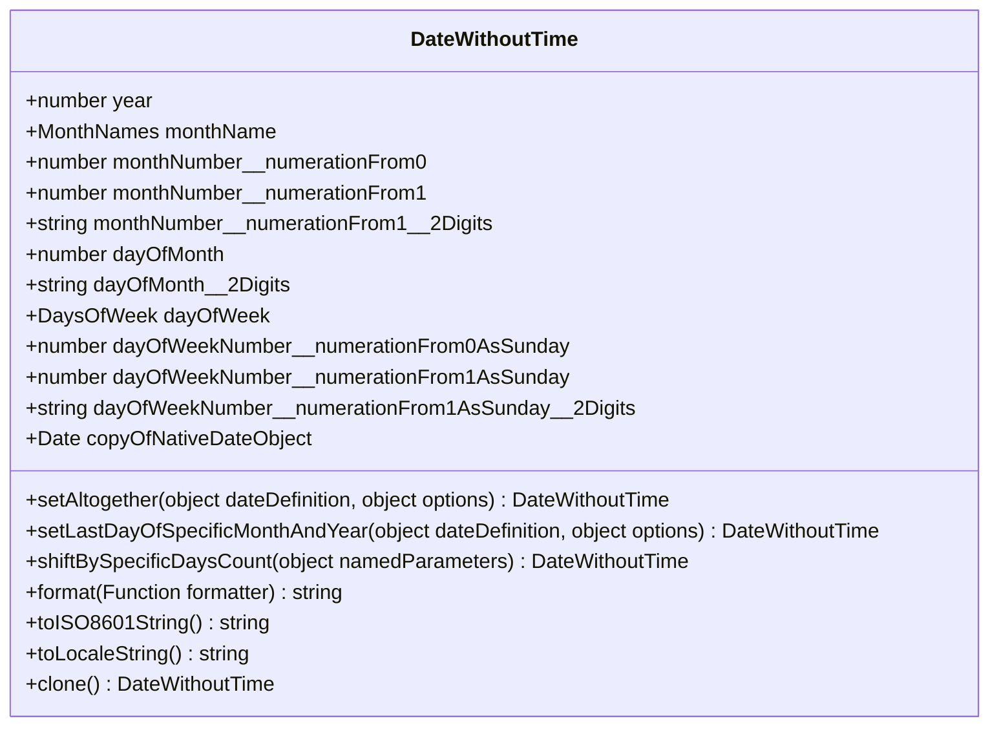

# `DateWithoutTime` class

Intended to be used instead of [TimePoint](https://github.com/TokugawaTakeshi/Yamato-Daiwa-ES-Extensions/blob/master/CoreLibrary/Package/Documentation/DateTime/TimePoint.md) 
  and native [Date](https://developer.mozilla.org/en-US/docs/Web/JavaScript/Reference/Global_Objects/Date) when the time 
  (hours, minutes, seconds, milliseconds) does not matter.




## Minimal theory
### Year/month dependent dates

The days count in each month is not equal. Basically, it is 30 or 31, but February has 29 days for the 
[leap year](https://en.wikipedia.org/wiki/Leap_year) and 28 - for non-leap year (actual for Gregorian calendar).

It means we could not set day of month to 31 when want to set to last day of the specific month because it could be not 31.


### Disadvantages of the native `Date`

#### Inaccurate name

Although the native object is being called `Date`, it includes the time definition until milliseconds.
The most correct names for this object should be the `DateAndTime` or `TimePoint` (the second one has been used in this library).


#### Zero-based months numeration

Although there is the "in the programming, the numeration of months is 0-based" convention, it is the stumbling block
for many programmer and not only the juniors.
In YDEE, all functionality working with dates forces the programmer to comprehend from 0 or 1 the numeration starts
(however, both options available).


#### The construction with magic numbers

It is the fundamental disadvantage of position-based parameters.
Some developers believe position-based parameters are cleaner, hover it is the huge maintainability impact because
  to understand the meaning of these parameters the checking of documentation could require herewith it is dangerous
  to count on human's memory.

```typescript
new Date(2022, 10, 12, 2, 45, 34, 302)
```

### The ISO8601 date/time definition

When [create the new instance of `Date`](https://developer.mozilla.org/en-US/docs/Web/JavaScript/Reference/Global_Objects/Date/Date)
  or use [`Date.parse`](https://developer.mozilla.org/en-US/docs/Web/JavaScript/Reference/Global_Objects/Date/parse),

* if the time has not been explicitly specified (e. g. "2023-01-10"), it will be assumed 00:00:00 of Greenwich meridian.
* if time has been explicitly specified (e. g. "2023-01-10T12:00"), it will be treated as local.

It also possible to explicitly specify the time zone (e. g. "2023-01-10T18:31:42+03:30"), however the
  [`Date.prototype.toISOString()`](https://developer.mozilla.org/en-US/docs/Web/JavaScript/Reference/Global_Objects/Date/toISOString)
  always returns the definition based on Greenwich meridian.

Below examples are actual for UTC+0900 time zone:

```typescript
console.log(new Date("2023-01-10T12:00").toLocaleString());
// -> "2023/1/10 12:00:00"

console.log(new Date("2023-01-10T12:00").toISOString());
// -> "2023-01-10T03:00:00.000Z"


console.log(new Date("2023-01-10T18:31:42+03:30").toLocaleString());
// -> "2023/1/11 0:01:42"

console.log(new Date("2023-01-10T18:31:42+03:30").toISOString());
// -> "2023-01-10T15:01:42.000Z"
```

## Constructor

```
(rawDateTime: Date | DateWithoutTime.DateDefinition | string | number): DateWithoutTime 
```

Supports 4 types of valid values:

1. Native `Date` object
2. Object-type definition:

```typescript
type DateDefinition =
    {
      year: number;
      dayOfMonth: number;
    } & MonthDefinition;

type MonthDefinition =
    { monthName: MonthsNames; } |
    { monthNumber__numerationFrom0: number; } |
    { monthNumber__numerationFrom1: number; };
```

3. [ISO8601 string](https://en.wikipedia.org/wiki/ISO_8601)
   (Warning: even has not been specified explicitly, the timezone of ISO8601 string is always zero UTC offset.
    This value will be recomputed to the date actual for the local machine.)
4. Milliseconds amount since the January 1, 1970, UTC.

* Once instance of `DateWithoutTime` has been created, hours, minutes, seconds and milliseconds passed via constructor
  will be lost. If you are not all right with it, `DateWithoutTime` is not for your case - use `TimePoint` instead.
* Regardless to passed parameter's type `InvalidParameterValueError` will be thrown if specified date is invalid.


### Examples

```typescript
const dateWithoutTime: DateWithoutTime = new DateWithoutTime("08 January 2013");

console.log(dateWithoutTime.year); // -> 2013
console.log(dateWithoutTime.monthNumber__numerationFrom0); // -> 0
console.log(dateWithoutTime.monthNumber__numerationFrom1); // -> 1
console.log(dateWithoutTime.monthNumber__numerationFrom1__2Digits); // -> "01"
console.log(dateWithoutTime.monthName); // -> "JANUARY"
console.log(dateWithoutTime.dayOfMonth); // (Time zone dependent) 
console.log(dateWithoutTime.dayOfMonth__2Digits); // (Time zone dependent)
```

In the above example, because the date specified in ISO8601 format, the date could be not 8 - it depends on time zone.
Unlike, in below example the day of month will be always `8`:

```typescript
const sample1: DateWithoutTime = new DateWithoutTime(new Date(2013, 0, 8));

Assert.strictEqual(sample1.year, 2013); // -> 2013
Assert.strictEqual(sample1.monthNumber__numerationFrom0, 0); // -> 0
Assert.strictEqual(sample1.monthNumber__numerationFrom1, 1); // -> 1
Assert.strictEqual(sample1.monthNumber__numerationFrom1__2Digits, "01"); // -> "01"
Assert.strictEqual(sample1.monthName, MonthsNames.january); // -> "JANUARY"
Assert.strictEqual(sample1.dayOfMonth, 8); // 8
Assert.strictEqual(sample1.dayOfMonth__2Digits, "08"); "08"
```

[//]: # (TODO Via object )


## Getters

This class has no the public fields.
The protected fields could be accessed only to circumvent the TypeScript.

The names of all getters has been selected such as no additional explanation required.
If it not such as, please feel free to open issue with "Unclear naming" category.

|                                    Name | Type   | Example for 8 Jan 2013 | Example for 1 Dec 2014 |
|----------------------------------------:|--------|------------------------|------------------------|
|                                  `year` | number | `2013`                 | `2014`                 |
|          `monthNumber__numerationFrom0` | number | `0`                    | `11`                   |
|          `monthNumber__numerationFrom1` | number | `1`                    | `12`                   |
| `monthNumber__numerationFrom1__2Digits` | string | `"01"`                 | `"12"`                 |
|                             `monthName` | string | `"JANUARY"`            | `"DECEMBER"`           |
|                            `dayOfMonth` | number | `8`                    | `1`                    |
|                   `dayOfMonth__2Digits` | string | `08`                   | `"01"`                 |


### `copyOfNativeDateObject`

The `DateWithoutTime` is using the native `Date` object internally.
It could be accessed only to circumvent the TypeScript.

Even if create the getter for this native `Date` object, it will be the [reference to original instance](https://javascript.info/object-copy) 
  and changing of it will cause the misalignment inside the associated instance of `DateWithoutTime`.
To avoid it, only copy of native `Date` has been made accessible legally - via `copyOfNativeDateObject` getter.


## Methods
### The date changing
#### `setAltogether`

```
(
  dateDefinition: Readonly<DateWithoutTime.DateDefinition>,
  options?: Readonly<{ immutably?: true; }>
): DateWithoutTime
```

Specify the year, month and day of month at once.

* Using this method, you must be sure that specified day of month does not exceed the last day of target year and month,
  otherwise the `InvalidParameterValueError` could be thrown. If you want to specify last day of specific year and month,
  use the [`setLastDayOfSpecificMonthAndYear`](#setlastdayofspecificmonthandyear) method instead.
* The returned value will be the current self instance if the second parameter is not specified.  
  With the second parameter, the new instance of `DateWithoutTime` will be created that is demanded in some frameworks like React. 


#### Examples
##### Mutable changing

```typescript
const initialInstance: DateWithoutTime = new DateWithoutTime({
  year: 2022,
  monthName: MonthsNames.august,
  dayOfMonth: 1
});

initialInstance.setAltogether({
  year: 2023,
  monthName: MonthsNames.january,
  dayOfMonth: 15
});

console.log(initialInstance.year); // -> 2023
console.log(initialInstance.monthNumber__numerationFrom0); // -> 0
console.log(initialInstance.monthNumber__numerationFrom1); // -> 1
console.log(initialInstance.monthNumber__numerationFrom1__2Digits); // -> "01"
console.log(initialInstance.monthName); // -> MonthsNames.january
console.log(initialInstance.dayOfMonth); // -> 15
console.log(initialInstance.dayOfMonth__2Digits); // -> "15"
```

##### Immutable changing

```typescript
const initialInstance: DateWithoutTime = new DateWithoutTime({
  year: 2022,
  monthName: MonthsNames.august,
  dayOfMonth: 1
});

const newInstance: DateWithoutTime = initialInstance.setAltogether(
  {
    year: 2023,
    monthName: MonthsNames.january,
    dayOfMonth: 15
  },
  { immutably: true }
);


console.log(newInstance.year); // -> 2023
console.log(newInstance.monthNumber__numerationFrom0); // -> 0
console.log(newInstance.monthNumber__numerationFrom1); // -> 1
console.log(newInstance.monthNumber__numerationFrom1__2Digits); // -> "01"
console.log(newInstance.monthName); // -> MonthsNames.january
console.log(newInstance.dayOfMonth); // -> 15
console.log(newInstance.dayOfMonth__2Digits); // -> "15"


console.log(initialInstance.year); // -> 2022
console.log(initialInstance.monthNumber__numerationFrom0); // -> 7
console.log(initialInstance.monthNumber__numerationFrom1); // -> 8
console.log(initialInstance.monthNumber__numerationFrom1__2Digits); // -> "08"
console.log(initialInstance.monthName); // -> MonthsNames.august
console.log(initialInstance.dayOfMonth); // -> 1
console.log(initialInstance.dayOfMonth__2Digits); // -> "01"
```


#### `setLastDayOfSpecificMonthAndYear`

```
(
  dateDefinition: Readonly<Omit<DateWithoutTime.DateDefinition, "dayOfMonth">>,
  options?: Readonly<{ immutably?: true; }>
): DateWithoutTime
```

Set the last day of specified year and month.

The returned value will be the current self instance if the second parameter is not specified.
With the second parameter, the new instance of `DateWithoutTime` will be created that is demanded in some frameworks like React.

[//]: # (TODO テスト・例)


#### `shiftBySpecificDaysCount`

```
(
  namedParameters: Readonly<
    { daysCount: number; } &
    (
      {
        toFuture: true;
        toPast?: undefined;
      } |
      {
        toPast: true;
        toFuture?: undefined;
      }
    ) &
    { immutably?: true; }
  >
): DateWithoutTime
```

Rewinds date to past or forwards it to future by specified days count.

[//]: # (TODO テスト・例)


### Formatting

#### `format`

```
(formatter: (selfInstance: DateWithoutTime) => string): string
```

Allows to get formatted date without storing of the `DateTime` instance to variable.
For example,

```typescript
const dateWithoutTime: DateWithoutTime = new DateWithoutTime("08 January 2013");

console.log(
  `${ dateWithoutTime.year }/` +
  `${ dateWithoutTime.monthNumber__numerationFrom1__2Digits }/` +
  `${ dateWithoutTime.dayOfWeekNumber__numerationFrom1AsSunday__2Digits }`
);
```

could be refactored without creating of new variable:

```typescript
console.log(
  new DateWithoutTime("08 January 2013").
      format((instance: DateWithoutTime): string =>
          `${ instance.year }/` + 
          `${ instance.monthNumber__numerationFrom1__2Digits }/` + 
          `${ instance.dayOfWeekNumber__numerationFrom1AsSunday__2Digits }`  
      )
);
```


#### `toISO8601String`

```
(): string
```

Returns the stringified date definition according [ISO8601](https://en.wikipedia.org/wiki/ISO_8601) without explicitly
  defined time.
From the viewpoint of ISO8601, if the time has not been explicitly defined, it is accepted that `00:00:00:000`.

Note that ISO8601 is always refers to Greenwich meridian (zero UTF offset) that is why the date could not match
  with hte local one.


#### `toLocaleString`

```
(): string
```

Return the local date representation. 
For example, for the 12 December 2022 and Japanese locale, the result was `2012年12月20日木曜日`.


#### `clone`

```
(): DateWithoutTime
```

Creates the independent clone of current instance.
