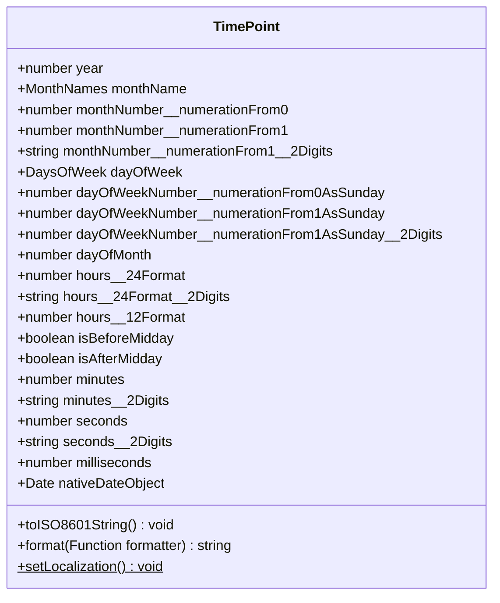

# `TimePoint`

[](https://plugins.jetbrains.com/plugin/17638-yamato-daiwa-es-extensions)


The alternative to native `Date` allows to build the formatted date/time strings easily.



## Example

You will get below example inputted once use `tp` (the abbreviation of "Time Point") Live Template for 
IntelliJ IDEA family IDEs.

```typescript
const normalizedDateTime: TimePoint = new TimePoint(Date.now());

console.log(

  `Year: ${normalizedDateTime.year}\n\n` +

  "Month:\n" +
  `                                             Name: ${normalizedDateTime.monthName}\n` +
  `                       Number (numeration from 0): ${normalizedDateTime.monthNumber__numerationFrom0}\n` +
  `                       Number (numeration from 1): ${normalizedDateTime.monthNumber__numerationFrom1}\n` +
  `Month number (numeration from 1, always 2 digits): ${normalizedDateTime.monthNumber__numerationFrom1__2Digits}\n\n` +

  `Day of month: ${normalizedDateTime.dayOfMonth}\n\n` +

  "Day of week:\n" +
  `                                                 Name: ${normalizedDateTime.dayOfWeek}\n` +
  `                 Number (numeration from 0 as Sunday): ${normalizedDateTime.dayOfWeekNumber__numerationFrom0AsSunday}\n` +
  `                 Number (numeration from 1 as Sunday): ${normalizedDateTime.dayOfWeekNumber__numerationFrom1AsSunday}\n` +
  `Number (numeration from 1 as Sunday, always 2 digits): ${normalizedDateTime.dayOfWeekNumber__numerationFrom1AsSunday__2Digits}\n\n` +

  "Hours: \n" +
  `                     12 hours format: ${normalizedDateTime.hours__12Format} ${normalizedDateTime.isBeforeMidday ? "AM" : "PM"}\n` +
  `                     24 hours format: ${normalizedDateTime.hours__24Format}\n` +
  `   24 hours format (always 2 digits): ${normalizedDateTime.hours__24Format__2Digits}\n\n` +

  `Minutes: ${normalizedDateTime.minutes}` +
  `Minutes (always 2 digits): ${normalizedDateTime.minutes__2Digits}\n\n` +

  `Seconds: ${normalizedDateTime.seconds}` +
  `Seconds (always 2 digits): ${normalizedDateTime.seconds__2Digits}\n\n` +

  `Milliseconds: ${normalizedDateTime.milliseconds}\n\n` +

  `ISO 8614 string: ${normalizedDateTime.toISO8601String()}`
);
```

To get above formatted output, there is not need to create store the instance to the variable - there is the `format` method:

```typescript
new TimePoint(Date.now()).format(
  (selfInstance: TimePoint): string =>

      `Year: ${selfInstance.year}\n\n` +

      "Month:\n" +
      `                                             Name: ${selfInstance.monthName}\n` +
      `                       Number (numeration from 0): ${selfInstance.monthNumber__numerationFrom0}\n` +
      `                       Number (numeration from 1): ${selfInstance.monthNumber__numerationFrom1}\n` +
      `Month number (numeration from 1, always 2 digits): ${selfInstance.monthNumber__numerationFrom1__2Digits}`
      
      // And so on.
);
```


## About class name

Although native one called "Date", it includes also the time until milliseconds.

> JavaScript **`Date`** objects represent a single moment in time in a platform-independent format
>
> [MDN Web Docs](https://developer.mozilla.org/en-US/docs/Web/JavaScript/Reference/Global_Objects/Date)


If the time has not been specified explicitly, 0 hours by , 0 minutes, 0 seconds
For example, the `new Date(1991, 0, 1)` will be `Date: "1990-12-31T15:00:00.000Z"` (
for UTC+9 time zone - 1 January 1991 - 9 hours).

By conception, the `TimePoint` is also the entity including the full date and time until milliseconds,
however it has a lot of pre-computed read-only properties allows to construct the string with custom formatting 
(see the example above).
