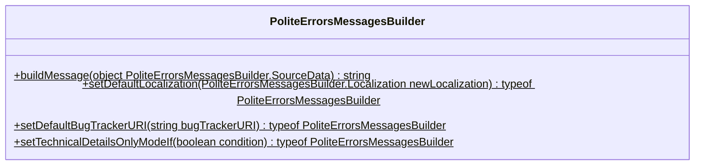

# `PoliteErrorsMessagesBuilder` class
## Abstract



Generates the polite errors messages for the `message` field of the instances of `Error` class or it's inheritors.
The polite expressions could be disabled until production, however the technical details parts will always be displayed.

Intended to be used mainly in the console applications, because in this case the error will output to console.
Do not use this message builder for the errors which has been by user, for example, by invalid configuration. 

All methods of this class are static. The main method is `buildMessage`; all other ones intended to be called once,
at the application entry point or near it.


## Problematic & motivation

Assume that you are developing the console utility and writing the code like this:

```typescript
const lintingIssues: ReadonlyArray<MarkupSourceCodeLinter.NormalizedLintingIssue> = linterInstance.
    checkFile(file.path).
    map((error: MarkupLinter.RawError): MarkupSourceCodeLinter.NormalizedLintingIssue =>
        ({
          code: error.code,
          message: error.msg,
          sourceListing: error.src,
          lineNumber: error.line,
          columnNumber: error.column
        }));
```

We know that here the error could occur. Why? Thousands of conditions and combination os them.
But it will occur, the application will crush with error message like this: 


```
TypeError: Cannot read property 'slice' of undefined
    at ProgressBarController.tick (C:\Users\your_user\AppData\Roaming\nvm\v6.1.0\node_modules\example\lib\progressBar.js:61:50)
    at C:\Users\your_user\AppData\Roaming\nvm\v6.1.0\node_modules\example\lib\commands\BootstrapCommand.js:134:32
    at Package.runScript (C:\Users\your_user\AppData\Roaming\nvm\v6.1.0\node_modules\example\lib\Package.js:61:9)
    at C:\Users\your_user\AppData\Roaming\nvm\v6.1.0\node_modules\example\lib\commands\BootstrapCommand.js:133:15
    at C:\Users\your_user\AppData\Roaming\nvm\v6.1.0\node_modules\example\node_modules\async\lib\async.js:718:13
    at replenish (C:\Users\your_user\AppData\Roaming\nvm\v6.1.0\node_modules\example\node_modules\async\lib\async.js:319:21)
    at C:\Users\your_user\AppData\Roaming\nvm\v6.1.0\node_modules\example\node_modules\async\lib\async.js:330:15
    at _parallel (C:\Users\your_user\AppData\Roaming\nvm\v6.1.0\node_modules\example\node_modules\async\lib\async.js:717:9)
    at Object.async.parallelLimit (C:\Users\your_user\AppData\Roaming\nvm\v6.1.0\node_modules\example\node_modules\async\lib\async.js:735:9)
    at C:\Users\your_user\AppData\Roaming\nvm\v6.1.0\node_modules\example\lib\PackageUtilities.js:298:27
```

Which like will be the reaction of your user? 
It will be something like: "What the hell?! Does it have some relationship with me?! What I have did wrong?!".

What we can do? Try/catch, of course:

```typescript
let lintingIssues: ReadonlyArray<MarkupSourceCodeLinter.NormalizedLintingIssue>; 
   
try {

  linterInstance.checkFile(file.path).map((error: MarkupLinter.RawError): MarkupSourceCodeLinter.NormalizedLintingIssue =>
      ({
        code: error.code,
        message: error.msg,
        sourceListing: error.src,
        lineNumber: error.line,
        columnNumber: error.column
      }));
  
} catch {
  
  console.error("The linting error occurred.");
  
  return;
  
}
```

Better, but makes no sense. Now the user's reaction will be like: "And what?!".
Also, we can not return in all cases; maybe the function/method inside which above try/catch is being executed, must
return something.

```typescript
let lintingIssues: ReadonlyArray<MarkupSourceCodeLinter.NormalizedLintingIssue>; 
   
try {

  linterInstance.checkFile(file.path).map((error: MarkupLinter.RawError): MarkupSourceCodeLinter.NormalizedLintingIssue =>
      ({
        code: error.code,
        message: error.msg,
        sourceListing: error.src,
        lineNumber: error.line,
        columnNumber: error.column
      }));
  
} catch (error: unknown) {
  
  console.error("The linting error occurred.");
  
  throw error;
  
}
```

That's better. The TypeScript plugin for ESLint could complain about we are throwing the `unknown` value, but the user
will know what happen and if your issue template in the GitHub is not big, maybe he will report the issue.

But can we improve above logging? Yes, for example:

1. Apologize politely to user (production mode only)
2. Explain what happen with minimal technical details (production mode only)
3. Ask the user to open issue with link to issue opening page (production mode only)
4. Explain what happen with details for the engineers.

The **PoliteErrorsMessagesBuilder** helps to build such messages, herewith takes care about polite explanation.
Although the preparing of the above texting could take a lot of time, this routine could be delegated to junior
developers.

Finally, cove will be like:

```typescript
let lintingIssues: ReadonlyArray<MarkupSourceCodeLinter.NormalizedLintingIssue>;

try {

  linterInstance.checkFile(file.path).map((error: MarkupLinter.RawError): MarkupSourceCodeLinter.NormalizedLintingIssue =>
      ({
        code: error.code,
        message: error.msg,
        sourceListing: error.src,
        lineNumber: error.line,
        columnNumber: error.column
      }));

} catch (error: unknown) {

  Logger.throwErrorAndLog({
    errorType: "Markup linting error",
    title: MarkupSourceCodeLinter.localization.pugLintingFailedErrorLog.title,
    description: PoliteErrorsMessagesBuilder.buildMessage({
      technicalDetails: "The error occurred during execution of 'pugLintInstance.checkFile(filePath)'",
      politeExplanation: "The Pug linter has thrown the error under unknown for YDA developers combination " +
          " of conditions."
    }),
    occurrenceLocation: "markupSourceCodeLinter.lint()",
    innerError: error
  });

}
```

Output will be like:

[//]: # (TODO 再開点)


## Methods

## `buildMessage`

```
(
  namedParameters: {
    technicalDetails: string;
    politeExplanation: string;
    bugTrackerURI?: string;
    isTechnicalsDetailOnlyMode?: boolean;
    localization?: Localization;
  }
): string
```

The main method of this class doing the main thing for which has been designed - generated the polite error message.
The first and only parameters accepts below properties:

<dl>

  <dt>technicalDetails</dt>
  <dd>
    <dl>
      <dt>Description</dt>
      <dd>
        The message part indented for developers, however will be displayed to user.
        The template part asks the user to append this part when open the issue. 
      </dd>
      <dt>Type</dt>
      <dd>string</dd>
      <dt>Is required</dt>
      <dd>yes</dd>
    </dl>
  </dd>

  <dt>politeExplanation</dt>
  <dd>
    <dl>
      <dt>Description</dt>
      <dd>
        The polite explanation indented for the users.
        Main guideline is use as few technical terms and details as possible - although most likely the user of the console
        application is engineer, he don't need to know the details of your application.
      </dd>
      <dt>Type</dt>
      <dd>string</dd>
      <dt>Is required</dt>
      <dd>yes</dd>
    </dl>
  </dd>

  <dt>bugTrackerURI</dt>
  <dd>
    <dl>
      <dt>Description</dt>
      <dd>
        The bug tracker URI where user being prompted to open the issue.
        It is a GitHub or similar service, use at least the issues page URI, not the top page of the repository.
        Ideally, it should be the page with new issue form with minimalistic template.
        If not specified, the URI has been set by <code>setDefaultBugTrackerURI</code> method will be used.
        If <code>setDefaultBugTrackerURI</code> method has not been invoked, no open issue prompting will be displayed.  
      </dd>
      <dt>Type</dt>
      <dd>string</dd>
      <dt>Is required</dt>
      <dd>no</dd>
    </dl>
  </dd>

  <dt>isTechnicalsDetailOnlyMode</dt>
  <dd>
    <dl>
      <dt>Description</dt>
      <dd>
        Disabling the polite mode and displays only <code>technicalDetails</code>.
        Intended to be used only in local development mode.
        In this case, it is better to invoke <code>setTechnicalDetailsOnlyModeIf</code> method one time instead.
      </dd>
      <dt>Type</dt>
      <dd>boolean</dd>
      <dt>Default value</dt>
      <dd>false</dd>
    </dl>
  </dd>

  <dt>localization</dt>
  <dd>
    <dl>
      <dt>Description</dt>
      <dd>
        The localization object for the displaying of message template part on other language.
        It is meaningful only of the <code>politeExplanation</code> will be displayed on same language.
        If you want to set the localization once, use <code>setDefaultLocalization</code> method instead.
      </dd>
      <dt>Type</dt>
      <dd>string</dd>
      <dt>Is required</dt>
      <dd>No</dd>
    </dl>
  </dd>

</dl>


### Auxiliary methods

The remain methods are intended to be called once, in the application entry point or near it.
The typical usage is:

```typescript
PoliteErrorsMessagesBuilder.
    setTechnicalDetailsOnlyModeIf(ConfiguratonRepresentative.isDevelopmentBuildingMode).    
    setDefaultLocalization(PoliteErrorsMessagesBuilderLocalization__Esperanto)
    setDefaultBugTrackerURI(ConfiguratonRepresentative.bugTrackerURI)
```

#### `setDefaultLocalization`

```
(newLocalization: PoliteErrorsMessagesBuilder.Localization): typeof PoliteErrorsMessagesBuilder
```

Applies the localization which will used for the building of all messages by `buildMessage` unless method 
`namedParameters.localization` explicitly specified.


#### `setDefaultBugTrackerURI`

```
(bugTrackerURI: string): typeof PoliteErrorsMessagesBuilder
```

Applies the default but tracker URI which will used for the building of all messages by `buildMessage` method unless
`namedParameters.bugTrackerURI` explicitly specified.


#### `setTechnicalDetailsOnlyModeIf`

```
(condition: boolean): typeof PoliteErrorsMessagesBuilder
```

Conditionally activates the technical details only mode (displaying the error message without polite phrase).
Usually, this condition is "is development mode?" and in should not be truthy on production mode.


### Localization

The localization is obeying to below TypeScript type.

```typescript
export type Localization = Readonly<{
  introduction: string;
  generateReportingRequest: (namedParameters: Readonly<{ bugTrackerURI: string; }>) => string;
  whatHappened: Readonly<{
    heading: string;
    introduction: string;
  }>;
  technicalDetails: Readonly<{
    heading: string;
    introduction: string;
  }>;
}>;
```

If no official localization available for your language, you can define it yourself.


### Used by

The most active used of the **PoliteErrorsMessagesBuilder** is 
[Yamato Daiwa Automation](https://github.com/TokugawaTakeshi/Yamato-Daiwa-Automation)
library that is the console application.

However, the **PoliteErrorsMessagesBuilder** is also being used by some helper libraries, for example,
the 
