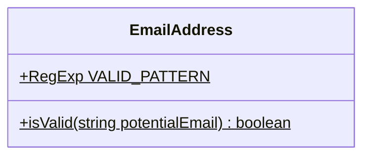

# `EmailAddress`

Fully static utility class for the validation of email address.



## Static fields
### `VALID_PATTERN`

The regular expression of valid email address.
Adopted from [www.w3resource.com](https://www.w3resource.com/javascript/form/email-validation.php).


## Static methods
### `isValid`

```
isValid(potentialEmail: string): boolean
```

Checks is `potentialEmail` obeying to `EmailAddress.VALID_PATTERN`.

```typescript
console.log(EmailAddress.isValid("mysite@ourearth.com")); // => true
console.log(EmailAddress.isValid("mysite.ourearth.com")); // => false
```
