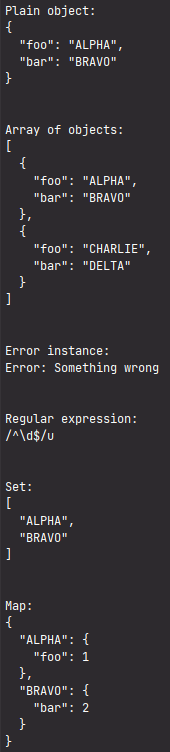

# stringifyAndFormatArbitraryValue

Stringifies and formats as possible the value of arbitrary type.
Intended to be used in mainly in logging.

* Strings will be returned as is.
* Numbers, booleans, undefined and null will be stringified without visible formatting.
* The instances of errors will be stringified as `String(rawEntity)`
* The regular expressions will be stringified as `rawEntity.toString()` (`String(rawEntity)` could output `{}`).
* The [Sets](https://developer.mozilla.org/en-US/docs/Web/JavaScript/Reference/Global_Objects/Set) will be converted to Array
  and then stringified (without preliminary converting `[object Set]` could be outputted).
* The [Maps](https://developer.mozilla.org/en-US/docs/Web/JavaScript/Reference/Global_Objects/Map) will be preprocessed by
  `Object.fromEntries()` and then stringified (without preliminary converting `[object Map]` could be outputted)
* All other objects including arrays which could be converted to JSON will be stringified and formatted as `JSON.stringify(rawEntity, null, 2)`
* All objects which could not be converted to JSON will be converted to string as `String(rawEntity)`


## Problems

Basically, the console output is environment dependent.

For the object case, the `.toString()` returns `[object Object]` as default. 
It's better to format in via `JSON.stringify(rawValue, null, 2)`, but not all objects could be stringified 
(for example, the circular entities.), so `JSON.stringify` could throw the error. 


## Examples

```typescript
console.log("Plain object:");
console.log(stringifyAndFormatArbitraryValue({ foo: "ALPHA", bar: "BRAVO" }));

console.log("\n");
console.log("Array of objects:");
console.log(stringifyAndFormatArbitraryValue([
  { foo: "ALPHA", bar: "BRAVO" },
  { foo: "CHARLIE", bar: "DELTA" }
]));

console.log("\n");
console.log("Error instance:");
console.log(stringifyAndFormatArbitraryValue(new Error("Something wrong")));

console.log("\n");
console.log("Regular expression:");
console.log(stringifyAndFormatArbitraryValue(/^\d$/u));

console.log("\n");
console.log("Set:");
console.log(stringifyAndFormatArbitraryValue(new Set([ "ALPHA", "BRAVO" ])));

console.log("\n");
console.log("Map:");
console.log(stringifyAndFormatArbitraryValue(new Map([
  [ "ALPHA", { foo: 1 } ],
  [ "BRAVO", { bar: 2 } ]
])));

```

For the Node.js console the output will be:


