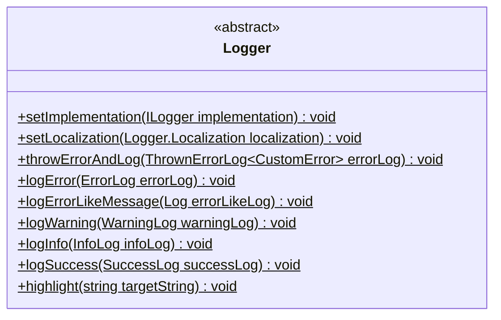
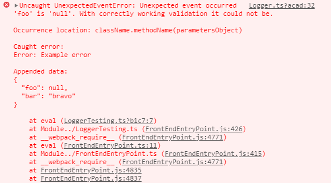
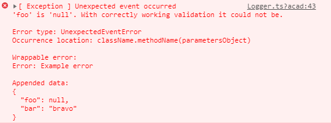
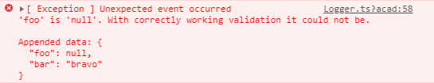
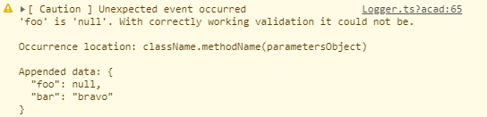
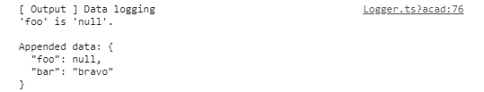
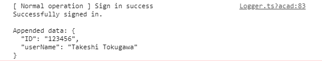

# `Logger` facade

Most of the developers and customers does not wish that anyone can check the logs in console of the browser.
That's why `@yamato-daiwa/ex-extensions` does not use the `console` methods directly - it uses `Logger`
[facade](https://en.wikipedia.org/wiki/Facade_pattern) instead.

As default, `Logger` using the `console` as usual, but it's possible to change this behaviour and also:

* Set the multiple output destinations, e. g. besides the normal console output add the data submitting to some logging 
  service like [Sentry](https://sentry.io/).
* Set the restriction of logs output to console in production building mode of the website/web application.
* Add the formatting to log.


## Schema




## Methods
### `setImplementation`: switch the `Logger` facade to non-default implementation

```
setImplementation(implementation: ILogger): typeof Logger
```

Basically,

* In the production mode of the front-end application the logs are being frequently submitted to logging service 
  (e. g. [Sentry](https://sentry.io/)) instead of the output in console, but no need to do same thing in local development mode.
* In production mode of server applications, besides the console output logs are being frequently submitted to database,
  or, again, third-party logging service.
* For the console utilities aimed for engineer users, basically nothing requires besides of normal of formatted output to console,
  but some application could collect the statistics.
  
`setImplementation` accepts the implementation of the interface `ILogger` or the class/object compatible with `ILogger`.

<!-- TODO examples for the frontend and backend -->


### `setLocalization`: localizes the static string which are being used by `Logger` facade

```
setLocalization(localization: Logger.Localication): void
```

Please note that the localization of `Logger` facade does not affect to it's implementations and also pre-made errors.


### `throwErrorAndLog`: throw the error and make log

```
throwErrorAndLog<CustomError extends Error>(errorLog: ThrownErrorLog<CustomError>): never
```

Throws the `errorInstance` if it specified on `errorLog` parameter, or error which will be created from `errorInstance.errorType` 
(will be stored in `name` field of `Error.prototype`) and `errorInstance.description` (will be stored in `message` field of 
`Error.prototype`).

```typescript
type ThrownErrorLog<CustomError extends Error = Error> =
    Omit<Log, "description" | "customBadgeText"> &
    ({
      errorInstance: CustomError;
    } | {
      errorType: string;
      description: string;
    }) &
    {
      occurrenceLocation: string;
      wrappableError?: unknown;
    };

type Log = {
  customBadgeText?: string;
  title: string;
  description: string;
  additionalData?: { [key: string]: unknown; };
};
```

#### Example

```typescript
try {
  throw new Error("Example error");
} catch (error: unknown) {
  Logger.throwErrorAndLog({
    errorInstance: new UnexpectedEventError("'foo' is 'null'. With correctly working validation it could not be."),
    title: UnexpectedEventError.DEFAULT_TITLE,
    occurrenceLocation: "className.methodName(parametersObject)",
    wrappableError: error,
    customBadgeText: "Exception",
    additionalData: {
      foo: null,
      bar: "bravo"
    }
  });
}
```

With default implementation of the `ILogger` the output in Chrome browser's console will be:




#### The difference between `title` and `errorType`

|  `errorType`  | `title` |
| ---- | ---- |
| Is being used for `Error.prototype.name` value |  Is being used for readable logs  |
| Basically has "Error" postfix, e. g. "UnexpectedEventError" |  No "Error" postfix required  |
| Recommended to be written in Pascal case | Recommended to be written as normal text obeying to grammar |
| Not subject to localization | Could be localized |

#### `occurrenceLocation`

It's not always obvious where the error has been occurred from the stack trace.
THe `occurrenceLocation` is being aimed to compensate it.

Usually the `occurrenceLocation` is a function name or class and method name.

Be careful when using the 
[`Function.name`](https://developer.mozilla.org/ja/docs/Web/JavaScript/Reference/Global_Objects/Function/name): 
the origin function name will be lost during Webpack's or similar tool's production building optimization.


### `logError`: error logging without throwing

```
logError(errorLog: ErrorLog): void
```

Logs the error without throwing it.

```typescript

export type ErrorLog =
    Log &
    {
      errorType: string;
      occurrenceLocation: string;
      caughtError?: unknown;
    };
```


#### Example

```typescript
try {
  throw new Error("Example error");
} catch (error: unknown) {

  Logger.logError({
    errorType: UnexpectedEventError.NAME,
    title: UnexpectedEventError.DEFAULT_TITLE,
    description: "'foo' is 'null'. With correctly working validation it could not be.",
    occurrenceLocation: "className.methodName(parametersObject)",

    customBadgeText: "Exception",
    caughtError: error,
    additionalData: {
      foo: null,
      bar: "bravo"
    }
  });
}
```

With default implementation of the `ILogger` the output in Chrome browser's console will be:




### `logErrorLikeMessage`: logging of the message with error highlight and to errors stream

```
logErrorLikeMessage(errorLikeLog: Log): void
```

Logs the simple `Log` with red highlight. In the case of NodeJS, this log will be output to errors stream.

#### Example

```typescript
Logger.logErrorLikeMessage({
  title: UnexpectedEventError.DEFAULT_TITLE,
  description: "'foo' is 'null'. With correctly working validation it could not be.",
  customBadgeText: "Exception",
  additionalData: {
    foo: null,
    bar: "bravo"
  }
});
```

With default implementation of `ILogger` the output in Chrome browser's console will be:




### `logWarning`: logging of the warnings 

```
logWarning(warningLog: WarningLog): void
```

#### Example

```typescript
Logger.logWarning({
  customBadgeText: "Caution",
  title: UnexpectedEventError.DEFAULT_TITLE,
  occurrenceLocation: "className.methodName(parametersObject)",
  description: "'foo' is 'null'. With correctly working validation it could not be.",
  additionalData: {
    foo: null,
    bar: "bravo"
  }
});
```

With default implementation of `ILogger` the output in Chrome browser's console will be:




### `logInfo`: logging of the other messages

```
logInfo(infoLog: InfoLog): void 
```

Currently, the `InfoLog` is even with `Log` but in the future new properties could be added.

#### Example

```typescript
Logger.logInfo({
  customBadgeText: "Output",
  title: "Data logging",
  description: "'foo' is 'null'.",
  additionalData: {
    foo: null,
    bar: "bravo"
  }
});
```

With default implementation of `ILogger` the output in Chrome browser's console will be:




### `logSuccess`: logging of the success message

```
logSuccess(successLog: SuccessLog): void
```

Currently, the `SuccessLog` is even with `Log` but in the future new properties could be added.


#### Example

```typescript
Logger.logSuccess({
  title: "Sign in success",
  description: "Successfully signed in.",
  customBadgeText: "Normal operation",
  additionalData: {
    ID: "123456",
    userName: "Takeshi Tokugawa"
  }
});
```

With default implementation of `ILogger` the output in Chrome browser's console will be:




### `highlightText`: message text highlighting

As default do nothing because the formatting technology is environment-dependent.

This method exists in `Logger` facade because `Logger` may invoke this method.
