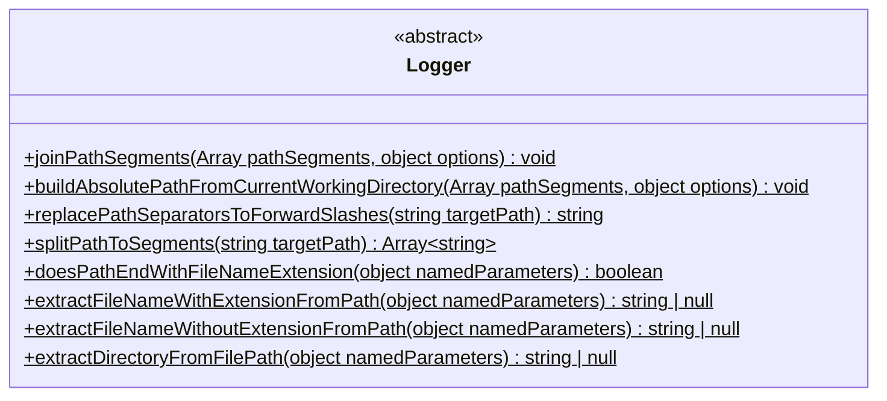
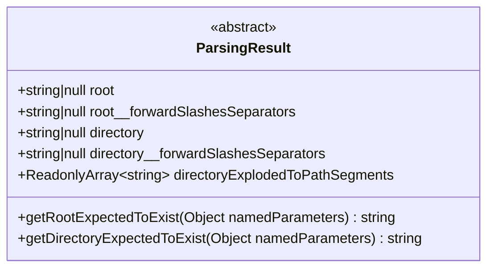

# `ImprovedPath` Improved native `Path` module




## Common theory

The separators of the path (of file or directory) are operating system dependent (&#92; for the Windows as default and `/` for
most of all operating systems). The native module [Path](https://nodejs.org/api/path.html) can dynamically build paths
with appropriate separators.

However, some utilities (for example [Chokidar](https://www.npmjs.com/package/chokidar)) handles correctly only paths with
forward slashes separators. It's why the part of methods of **ImprovedPath** has `alwaysForwardSlashSeparators` option.

Basically Windows understands forward slashes separators too, but some utilities (for example, some options of
[Webpack](https://webpack.js.org) configuration) requires system-dependent path separators.
So neither forward not backslashes could be safely used on Windows in all cases.


## Methods
### `joinPathSegments`: Join path segments

```
(pathSegments: Array<string>, options?: { alwaysForwardSlashSeparators?: boolean; }) => string
```

Works as native [`Path.join()`](https://nodejs.org/api/path.html#pathjoinpaths) without options, but 
always (irrespective of Operationing System) returns result with forward slashes separators with when
`alwaysForwardSlashSeparators` being set to `true`.


```typescript
import Path from "path";
import { ImprovedPath } from "@yamato-daiwa/es-extensions-nodejs";

const pathSegments: ReadonlyArray<string> = [ "/foo", "bar", "baz/asdf", "quux", ".." ];

/* Below two lines are equivalent */
console.log(Path.join(...pathSegments));
console.log(ImprovedPath.joinPathSegments(pathSegments));
/* Example output for Windows: "\foo\bar\baz\asdf" */

console.log(ImprovedPath.joinPathSegments(pathSegments, { alwaysForwardSlashSeparators: true }));
/* Example output for Windows: "/foo/bar/baz/asdf" */
```

#### Thrown errors

`InvalidParameterValueError` will be thrown if one or more path segments are invalid.


### `buildAbsolutePathFromCurrentWorkingDirectory`: Build absolute path from current working directory

```
(pathSegments: Array<string>, options?: { alwaysForwardSlashSeparators?: boolean; }) => string
```

Build absolute path from [current working directory](https://nodejs.org/api/process.html#processcwd), herewith the first 
parameter must not include the absolute path, that is the big difference with native 
[`Path.resolve()`](https://nodejs.org/api/path.html#pathresolvepaths). 

The native `Path.resolve()` is being frequently used with absolute path as first parameter while in this case
[`Path.join()`](https://nodejs.org/api/path.html#pathjoinpaths) could be safely used instead.
The motivation of `ImprovedPath.buildAbsolutePathFromCurrentWorkingDirectory()` is creating of method specialized
on computing of absolute path from current working directory method thus no need to specify it explicitly.

Additionally, by `alwaysForwardSlashSeparators` option, the path with forward slashes separators will be returned
irrespective to specific Operationing System.

```typescript
import Path from "path";
import { ImprovedPath } from "@yamato-daiwa/es-extensions-nodejs";

const pathSegments: ReadonlyArray<string> =[ "foo/bar", "./baz" ];

/* Below two lines are equivalent */
console.log(Path.join(...pathSegments));
console.log(ImprovedPath.buildAbsolutePathFromCurrentWorkingDirectory(pathSegments));
/* Example output for Windows: "D:\IntelliJ IDEA\InHouseDevelopment\YamatoDaiwaES_Extensions\NodeJS\Package\foo\bar\baz" */

console.log(ImprovedPath.buildAbsolutePathFromCurrentWorkingDirectory(pathSegments, { alwaysForwardSlashSeparators: true }));
/* Example output for Windows: "D:/IntelliJ IDEA/InHouseDevelopment/YamatoDaiwaES_Extensions/NodeJS/Package/foo/bar/baz" */
```

#### Thrown errors

`InvalidParameterValueError` will be thrown if:

* One or more path segments are including the absolute path
* One or more path segments are invalid


### `computeRelativePath`: The computing of relative path

```
(namedParameters: Readonly<{
  basePath: string;
  comparedPath: string;
  alwaysForwardSlashSeparators?: boolean;
}>) => string;
```

The analogue of native [`Path.relative()`](https://nodejs.org/api/path.html#pathrelativefrom-to) with below improvements:

* One parameter, of object type ("named parameters" patterns)
* Has option which replaced path separators to forward slashed irrespective to operationing system.

```typescript
console.log(ImprovedPath.computeRelativePath({ basePath: "/data/orandea/test/aaa", comparedPath: "/data/orandea/impl/bbb" }));
// Output for Windows : "..\\..\\impl\\bbb"
// Output for UNIX-Lkie OS: "../../impl/bbb"

console.log(ImprovedPath.computeRelativePath({ basePath: "C:\\orandea\\test\\aaa", comparedPath: "C:\\orandea\\impl\\bbb" }));
// Output for Windows : "..\\..\\impl\\bbb"
// Output for UNIX-Lkie OS: "../../impl/bbb"

console.log(ImprovedPath.computeRelativePath({
  basePath: "C:\\orandea\\test\\aaa",
  comparedPath: "C:\\orandea\\impl\\bbb",
  alwaysForwardSlashSeparators: true
})); 
// Output: "../../impl/bbb"
```


### `parsePath`: decompose the path to compounds

```
public static parsePath(targetPath: string): ImprovedPath.ParsingResult;
```

Analyzing the stringified path and returns the data structure `ParsingResult`.


#### `ParsingResult` data structure



#### Root
##### `root`

Returns the path root with operationing system dependent separators as string, or null of there is no root in path.
Unlike native `ParsedPath.root`, the `ParsingResult.parsedPath.root` is `null` when there is no root in path.
If you are sure that root is definitely must be in path, use `getRootExpectedToExist` method instead, 
but if there is no root actually, the `UnexpectedEventError` will be thrown. 

```typescript
import Path from "path";
import { ImprovedPath } from "@yamato-daiwa/es-extensions-nodejs";

const unixLikeSampleAbsolutePath: string = "/home/user/dir/file.txt";
const windowsLikeSampleAbsolutePath: string = "C:\\path\\dir\\file.txt";
const unixLikeSampleRelativePath: string = "home/user/dir/file.txt";
const windowsLikeSampleRelativePath: string = "path\\dir\\file.txt";

console.log(ImprovedPath.parsePath(unixLikeSampleAbsolutePath).root);
/* Output: "/" 
 * In this case, `ImprovedPath.ParsingResult.root` is equivalent to `Path.Parsed.path.root`. */

console.log(ImprovedPath.parsePath(windowsLikeSampleAbsolutePath).root);
/* Output: "C:\\" 
 * In this case, `ImprovedPath.ParsingResult.root` is equivalent to `Path.Parsed.path.root`. */

console.log(ImprovedPath.parsePath(unixLikeSampleRelativePath).root);
/* Output: null */

console.log(ImprovedPath.parsePath(windowsLikeSampleRelativePath).root);
/* Output: null */
```

#### `root__forwardSlashesSeparators`

Returns path root using forward slashes irrespective to operationing system as string, or null of there is no root in path.

```typescript
console.log(ImprovedPath.parsePath("C:\\path\\dir\\file.txt").root__forwardSlashesSeparators);
/* Output: "C:/" */
```


#### `getRootExpectedToExist(namedParameters?: { alwaysForwardSlashesSeparators: boolean; })`

Returns the path root if it exists, otherwise throws the `UnexpectedEventError`.

```typescript
// ↓　Will cause the UnexpectedEventError
ImprovedPath.parsePath("home/user/dir/file.txt").getRootExpectedToExist();
```

#### Directory

##### Theory

* The **directory** has not the clear definition, but in this context, the directory is the specific location in file system.
* The **directory** itself is unique, however, it's absolute path could be unknown. 
* Relative terms are **directory absolute path** and **directory relative path**. Without knowing of the reference
  point, **directory relative path** could not be converted to **directory absolute path**. 
* The **directory relative path** is including the **root**.


##### `directory`

Returns the path directory with operationing system dependent separators as string, or null of there is no directory in path
(more exactly, the directory is root).
Unlike native `ParsedPath.dir`, the `ImrpovedPath.ParsingResult.directory` is:

* `null` when there is no directory in path
* No prepended path separators will be (for example, `"home/user/dir"` instead `"/home/user/dir"` in `"/home/user/dir/file.txt"`
  case)

```typescript
import Path from "path";
import { ImprovedPath } from "@yamato-daiwa/es-extensions-nodejs";


/* Below 2 examples are equivatent: */
console.log(Path.parse("/home/user/dir/file.txt").dir);
// Output: "/home/user/dir"

console.log(ImprovedPath.parse("/home/user/dir/file.txt").directory);
// Output: "/home/user/dir"


/* Below 2 examples are equivatent. In this case, the directory is even with root. */
console.log(Path.parse("/file.txt").dir);
// Output: "/"

console.log(ImprovedPath.parse("/file.txt").directory);
// Output: "/"


/* In this case, it is considered that there is no directory, however just knowing the path we can't gurantee
 * that the 'file.txt" is the file, not directory. */
console.log(Path.parse("file.txt").dir);
// Output: ""

console.log(ImprovedPath.parse("file.txt").directory);
// Output: null


/* Below 2 examples are equivatent. In this case, the directory is even with root. */
console.log(Path.parse("C:\\file.txt").dir);
// Output: "C:\\"

console.log(ImprovedPath.parse("C:\\file.txt").directory);
// Output: "C:\\"
```


##### `directory__forwardSlashesSeparators`

Same as `directory` but path separators are always the forward slashes irrespective to Operationing System.

```typescript
import { ImprovedPath } from "@yamato-daiwa/es-extensions-nodejs";


console.log(ImprovedPath.parsePath("C:\\path\\dir\\file.txt").directory__forwardSlashesSeparators);
// Output for all Operationing systems: "C:/path/dir"

console.log(ImprovedPath.parsePath("C:\\file.txt").directory__forwardSlashesSeparators);
// Output for all Operationing systems: "C:"
```

##### `directoryExplodedToPathSegments`

The directory path (absolute or relative) has been split to segments as an array.
For the UNIX-like absolute paths, the first segment will be always `/` - it is only the case when `/` could be among segments.

```typescript
import { ImprovedPath } from "@yamato-daiwa/es-extensions-nodejs";

console.log(Path.parse("/home/user/dir/file.txt").directoryExplodedToPathSegments);
// Output: [ "/", "home", "user", "dir" ]

console.log(Path.parse("/file.txt").directoryExplodedToPathSegments);
// Output: [ "/" ]

console.log(Path.parse("file.txt").directoryExplodedToPathSegments);
// Output: [ ]

console.log(Path.parse("C:\\path\\dir").directoryExplodedToPathSegments);
// Output: [ "C:", "path", "dir" ]

console.log(Path.parse("C:\\file.txt").directoryExplodedToPathSegments);
// Output: [ "C:" ]
```

### `replacePathSeparatorsToForwardSlashes`

```
(targetPath: string): string
```

The alias of `replaceDoubleBackslashesWithForwardSlashes` function from the [core library](https://github.com/TokugawaTakeshi/Yamato-Daiwa-ES-Extensions/blob/master/CoreLibrary/Package/README.md).
Obviously, replacing double backslashes with forward slashes.


### `explodePathToSegments`

```
(targetPath: string): Array<string>
```

The directory path (absolute or relative) has been split to segments as an array.
For the UNIX-like absolute paths, the first segment will be always `/` - it is only the case when `/` could be among segments.

```typescript
console.log(ImprovedPath.explodePathToSegments(unixLikeSampleAbsolutePath)); // Output: [ "/", "home", "user", "dir", "file.txt" ]

console.log(ImprovedPath.explodePathToSegments("/file.txt")); // Output: [ "/", "file.txt" ]

console.log(ImprovedPath.explodePathToSegments("file.txt")); // Output: [ "file.txt" ]

console.log(ImprovedPath.explodePathToSegments("C:\\path\\dir\\file.txt")); // Output: [ "C:", "path", "dir", "file.txt" ]

console.log(ImprovedPath.explodePathToSegments("C:\\file.txt")); // Output: [ "C:", "file.txt" ]
```


### `doesPathEndWithFileNameExtension`

```
(
  namedParameters: Readonly<{
    targetPath: string;
    mustConsiderLasPathSegmentBeginsFromDotAsTheFileNameWithoutExtension: boolean;
  }>
): boolean
```

Returns `true` if target path includes the filename extensions, herewith it is required to specify how to consider the
file names without extensions like `"/home/user/dir/.env"` - the native **Path** [considers](https://stackoverflow.com/q/74035403/4818123)
`.env` like file name, but not it's extension.

```typescript
import Path from "path";
import { ImprovedPath } from "@yamato-daiwa/es-extensions-nodejs";

// In this case, everything is obvious and there are no pitfalls
console.log(Path.extname("/home/user/dir/file.txt")); // Output: ".txt"
console.log(Path.parse("/home/user/dir/file.txt").ext); // Output: ".txt"
console.log(ImprovedPath.doesPathEndWithFileNameExtension({
  targetPath: "/home/user/dir/file.txt",
  mustConsiderLasPathSegmentBeginsFromDotAsTheFileNameWithoutExtension: true
})); // Output: true


// Where there is no filename extension, the `extname` and `ParsedPath.ext` of native Path are empty stirngs
console.log(Path.extname("/home/user/dir/file")); // Output: ""
console.log(Path.parse("/home/user/dir/file").ext); // Output: ""
console.log(ImprovedPath.doesPathEndWithFileNameExtension({
  targetPath: "/home/user/dir/file",
  mustConsiderLasPathSegmentBeginsFromDotAsTheFileNameWithoutExtension: true
})); // Output: false


// First, the ".env" in below example could be the directory, however the native `Path` considering '.env' as
// the file name without extension, not as empty file name with extension:
console.log(Path.extname("/home/user/dir/.env")); // Output: ""
console.log(Path.parse("/home/user/dir/.env").ext); // Output: ""
console.log(Path.basename("/home/user/dir/.env").ext); // Output: ".env"

// The `ImprovedPath` will ask you how you are wish to interpret this case:

console.log(ImprovedPath.doesPathEndWithFileNameExtension({
  targetPath: "/home/user/dir/.env",
  mustConsiderLasPathSegmentBeginsFromDotAsTheFileNameWithoutExtension: true
})); // Output: true

console.log(ImprovedPath.doesPathEndWithFileNameExtension({
  targetPath: "/home/user/dir/.env",
  mustConsiderLasPathSegmentBeginsFromDotAsTheFileNameWithoutExtension: true
})); // Output: false
```
