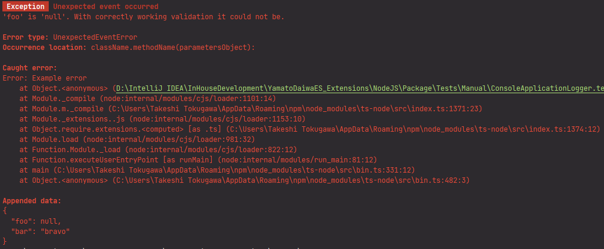
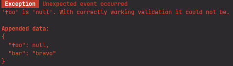
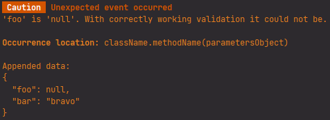
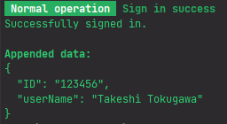
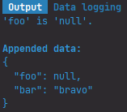

# **ConsoleApplicationLogger**

The implementation of `ILogger` interface for the `Logger` facade and Node.js applications.
As default, it just makes the logs more fancy than default `Logger` formatting what could be enough for the console
utilities and ever for server applications. However, if you need to add some additional functionality
(for example, the submitting of logs to some logging service) of change the formatting, you can use
**ConsoleApplicationLogger** inside your own implementation of `ILogger` interface.


```typescript
/* 〔 ✏ 〕 Set `ConsoleApplicationLogger` or your own implementation for the `Logger` facade */
Logger.setImplementation(ConsoleApplicationLogger);
```


## Methods

### `throwErrorWithFormattedMessage`: throw the error and make log

```
throwErrorWithFormattedMessage<CustomError extends Error>(errorLog: ThrownErrorLog<CustomError>): never
```

Because this method does not use the `console`, it has not some additional formatting and displays the error as regular
`Logger`.

```typescript
try {
  throw new Error("Example error");
} catch (error: unknown) {
  Logger.throwErrorWithFormattedMessage({
    errorInstance: new UnexpectedEventError("'foo' is 'null'. With correctly working validation it could not be."),
    title: UnexpectedEventError.localization.defaultTitle,
    occurrenceLocation: "className.methodName(parametersObject)",
    wrappableError: error,
    additionalData: {
      foo: null,
      bar: "bravo"
    }
  });
}
```


### `logError`: error logging without throwing

```
logError(errorLog: ErrorLog): void
```

```typescript
try {
  throw new Error("Example error");
} catch (error: unknown) {

  Logger.logError({
    errorType: UnexpectedEventError.NAME,
    title: UnexpectedEventError.DEFAULT_TITLE,
    description: "'foo' is 'null'. With correctly working validation it could not be.",
    occurrenceLocation: "className.methodName(parametersObject)",

    customBadgeText: "Exception",
    caughtError: error,
    additionalData: {
      foo: null,
      bar: "bravo"
    }
  });
}
```




### `logErrorLikeMessage`: logging of the message with error highlight and to errors stream

```
logErrorLikeMessage(errorLikeLog: Log): void
```

Logs the simple `Log` with red highlight. In the case of NodeJS, this log will be output to errors stream.

```typescript
Logger.logErrorLikeMessage({
  title: UnexpectedEventError.DEFAULT_TITLE,
  description: "'foo' is 'null'. With correctly working validation it could not be.",
  customBadgeText: "Exception",
  additionalData: {
    foo: null,
    bar: "bravo"
  }
});
```




### `logWarning`: logging of the warnings

```
logWarning(warningLog: WarningLog): void
```

```typescript
Logger.logWarning({
  customBadgeText: "Caution",
  title: UnexpectedEventError.DEFAULT_TITLE,
  occurrenceLocation: "className.methodName(parametersObject)",
  description: "'foo' is 'null'. With correctly working validation it could not be.",
  additionalData: {
    foo: null,
    bar: "bravo"
  }
});
```




### `logSuccess`: logging of the success messages

```
logSuccess(successLog: SuccessLog): void
```

```typescript
Logger.logSuccess({
  title: "Sign in success",
  description: "Successfully signed in.",
  customBadgeText: "Normal operation",
  additionalData: {
    ID: "123456",
    userName: "Takeshi Tokugawa"
  }
});
```




### `logInfo`: logging of the other messages

```
logInfo(infoLog: InfoLog): void 
```

```typescript
Logger.logInfo({
  customBadgeText: "Output",
  title: "Data logging",
  description: "'foo' is 'null'.",
  additionalData: {
    foo: null,
    bar: "bravo"
  }
});
```


